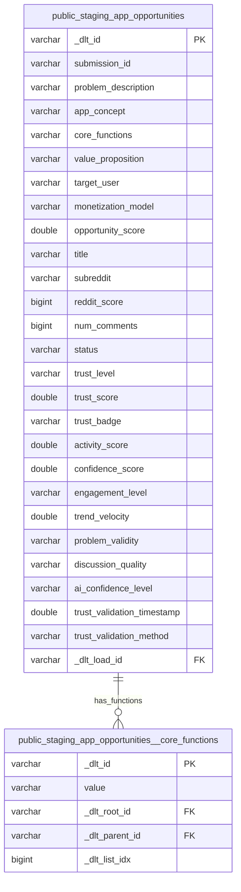

# RedditHarbor Entity Relationship Diagram

## Overview

This ERD represents the complete working schema as of 2025-11-17, extracted from `schema_dumps/dlt_trust_pipeline_success_schema_20251117_194348.sql`. The schema supports Reddit data collection, opportunity identification, market validation, and DLT-based pipeline processing.

## Schema Architecture

The database consists of three main logical domains:

1. **Reddit Data Domain**: Core Reddit entities (submissions, comments, redditors, subreddits)
2. **Opportunity Analysis Domain**: Business opportunity identification and scoring
3. **DLT Pipeline Domain**: Data load tracking and staging for ETL/ELT workflows

---

## Complete Entity Relationship Diagram

```mermaid
erDiagram
    %% =========================================================================
    %% REDDIT DATA DOMAIN - Core Reddit entities
    %% =========================================================================

    subreddits ||--o{ submissions : "contains"
    redditors ||--o{ submissions : "creates"
    redditors ||--o{ comments : "authors"
    submissions ||--o{ comments : "has"
    comments ||--o{ comments : "replies_to"
    submissions ||--o{ opportunities : "identifies"

    subreddits {
        uuid id PK
        varchar name UK
        text description
        int subscriber_count
        varchar category
        varchar target_market_segment "e.g., Health, Finance"
        timestamptz created_at
        timestamptz last_scraped_at
        boolean is_active
    }

    redditors {
        uuid id PK
        varchar username UK
        int karma_score
        int account_age_days
        varchar flair_type
        timestamptz created_at
        boolean is_anonymous "PII anonymization flag"
        text anonymized_id "Hashed user identifier"
        varchar redditor_reddit_id "Reddit API ID (e.g., dhg80)"
        boolean is_gold "Reddit Gold subscription"
        jsonb is_mod "Moderator status details"
        jsonb trophy "User trophies and achievements"
        varchar removed
        varchar name
        jsonb karma "Detailed karma breakdown"
    }

    submissions {
        uuid id PK
        uuid subreddit_id FK
        uuid redditor_id FK
        varchar title
        text content
        text content_raw
        int upvotes
        int downvotes
        int comments_count
        int awards_count
        timestamptz created_at
        varchar post_type "text, link, image, video"
        numeric sentiment_score "Range: -1.0 to 1.0"
        text problem_keywords "JSON or comma-separated"
        text solution_mentions "Current tools mentioned"
        text url
        boolean is_nsfw
        boolean is_spoiler
        varchar submission_id "Reddit API identifier"
        boolean archived
        boolean removed
        jsonb attachment
        jsonb poll
        jsonb flair
        jsonb awards
        jsonb score
        jsonb upvote_ratio
        jsonb num_comments
        boolean edited
        text text
        varchar subreddit "Denormalized subreddit name"
        text permalink
    }

    comments {
        uuid id PK
        uuid submission_id FK
        uuid redditor_id FK
        uuid parent_comment_id FK "Self-reference for hierarchy"
        text content
        text content_raw
        int upvotes
        timestamptz created_at
        numeric sentiment_score "Range: -1.0 to 1.0"
        text workaround_mentions "DIY solutions mentioned"
        int comment_depth "0 for top-level"
        varchar link_id "Reddit submission link ID"
        varchar comment_id "Reddit API comment ID"
        text body "Comment text content"
        varchar subreddit
        varchar parent_id "Reddit parent ID (e.g., t1_nncv8ho)"
        jsonb score
        boolean edited
        varchar removed
    }

    %% =========================================================================
    %% OPPORTUNITY ANALYSIS DOMAIN - Business opportunity tracking
    %% =========================================================================

    opportunities ||--o{ opportunity_scores : "scored_by"
    opportunities ||--o{ score_components : "has"
    opportunities ||--o{ market_validations : "validated_by"
    opportunities ||--o{ competitive_landscape : "analyzed_by"
    opportunities ||--o{ feature_gaps : "identifies"
    opportunities ||--o{ cross_platform_verification : "verified_on"
    opportunities ||--o{ monetization_patterns : "monetizes_via"
    opportunities ||--o{ technical_assessments : "assessed_by"
    opportunities ||--o{ user_willingness_to_pay : "shows"
    comments ||--o{ user_willingness_to_pay : "mentions_payment_in"

    opportunities {
        uuid id PK
        text problem_statement
        uuid identified_from_submission_id FK
        timestamptz created_at
        varchar status "identified, validated, rejected"
        int core_function_count "MAXIMUM 3, 4+ disqualifies"
        boolean simplicity_constraint_met "True only if 1-3 functions"
        text proposed_solution
        text target_audience
        varchar market_segment
        timestamptz last_reviewed_at
        varchar opportunity_id "String identifier for workflows"
        varchar app_name "Proposed application name"
        varchar business_category
        varchar source_subreddit
    }

    opportunity_scores {
        uuid id PK
        uuid opportunity_id FK
        int market_demand_score "0-100"
        int pain_intensity_score "0-100"
        int monetization_potential_score "0-100"
        int market_gap_score "0-100"
        int technical_feasibility_score "0-100"
        int simplicity_score "0-100: 1 func=100, 2=85, 3=70, 4+=0"
        numeric total_score "GENERATED: Weighted sum"
        timestamptz score_date
        varchar score_version "Default: 1.0"
        text scoring_notes
    }

    score_components {
        uuid id PK
        uuid opportunity_id FK
        varchar metric_name "e.g., discussion_volume, emotional_language"
        numeric metric_value
        text evidence_text "Supporting snippets"
        numeric confidence_level "0.0 to 1.0"
        text source_submission_ids "Comma-separated list"
        timestamptz calculated_at
    }

    market_validations {
        uuid id PK
        uuid opportunity_id FK
        varchar validation_type "problem_validation, market_validation, price_sensitivity"
        varchar validation_source
        timestamptz validation_date
        text validation_result
        numeric confidence_score "0.0 to 1.0"
        text notes
        varchar status "pending, completed, failed"
        text evidence_url
    }

    competitive_landscape {
        uuid id PK
        uuid opportunity_id FK
        varchar competitor_name
        text market_position
        varchar pricing_model
        text strengths
        text weaknesses
        numeric market_share_estimate "0.0 to 100.0"
        int user_count_estimate
        varchar verification_status "unverified, verified"
        timestamptz last_updated
    }

    feature_gaps {
        uuid id PK
        uuid opportunity_id FK
        varchar existing_solution
        text missing_feature
        int user_requests_count
        varchar priority_level "low, medium, high, critical"
        text user_evidence
        timestamptz identified_at
    }

    cross_platform_verification {
        uuid id PK
        uuid opportunity_id FK
        varchar platform_name "twitter, linkedin, product_hunt, app_store"
        varchar validation_status "pending, completed, failed"
        int data_points_count
        text data_points
        timestamptz verified_at
        numeric confidence_score "0.0 to 1.0"
        text platform_notes
    }

    monetization_patterns {
        uuid id PK
        uuid opportunity_id FK
        varchar model_type "subscription, one-time, freemium, marketplace, affiliate"
        numeric price_range_min
        numeric price_range_max
        numeric revenue_estimate
        varchar validation_status "preliminary, validated, rejected"
        varchar market_segment
        text pricing_evidence
        int potential_users
        timestamptz identified_at
    }

    technical_assessments {
        uuid id PK
        uuid opportunity_id FK
        text api_integrations_required
        text regulatory_considerations
        varchar development_complexity "low, medium, high, very_high"
        text resource_requirements
        varchar estimated_timeline
        int feasibility_score "0 to 100"
        text technical_notes
        text risk_factors
        timestamptz assessed_at
        varchar assessor
    }

    user_willingness_to_pay {
        uuid id PK
        uuid opportunity_id FK
        text payment_mention_text
        numeric price_point
        text user_context
        varchar user_segment
        numeric confidence_score "0.0 to 1.0"
        uuid source_comment_id FK
        timestamptz mentioned_at
    }

    %% =========================================================================
    %% WORKFLOW RESULTS - AI-driven opportunity processing
    %% =========================================================================

    workflow_results {
        uuid id PK
        varchar opportunity_id
        varchar app_name
        int function_count
        jsonb function_list "Array of core function names"
        double original_score
        double final_score
        varchar status
        boolean constraint_applied
        text ai_insight
        timestamptz processed_at
        numeric market_demand "0-100: Discussion volume + engagement"
        numeric pain_intensity "0-100: User pain signals"
        numeric monetization_potential "0-100: Revenue potential"
        numeric market_gap "0-100: Unmet market need"
        numeric technical_feasibility "0-100: Build complexity"
        numeric simplicity_score "0-100: Function count penalty"
        numeric opportunity_assessment_score "GENERATED: Weighted total"
    }

    %% =========================================================================
    %% DLT PIPELINE DOMAIN - Data load tracking (ETL/ELT infrastructure)
    %% =========================================================================

    _dlt_loads {
        varchar load_id PK
        varchar schema_name
        bigint status
        timestamptz inserted_at
        varchar schema_version_hash
    }

    _dlt_pipeline_state {
        varchar _dlt_id PK
        bigint version
        bigint engine_version
        varchar pipeline_name
        varchar state
        timestamptz created_at
        varchar version_hash
        varchar _dlt_load_id FK
    }

    _dlt_version {
        bigint version PK
        bigint engine_version
        timestamptz inserted_at
        varchar schema_name
        varchar version_hash
        varchar schema
    }

    _migrations_log {
        varchar migration_name PK
        timestamptz applied_at
    }

    app_opportunities__core_functions {
        varchar _dlt_id PK
        varchar value
        varchar _dlt_root_id
        varchar _dlt_parent_id
        bigint _dlt_list_idx
    }
```



---

## Scoring Methodology

### Opportunity Scores Table

The `opportunity_scores` table implements a **6-dimension weighted scoring system**:

| Dimension | Weight | Range | Description |
|-----------|--------|-------|-------------|
| Market Demand | 20% | 0-100 | Discussion volume + engagement rate + trend velocity |
| Pain Intensity | 25% | 0-100 | User pain signals and emotional language |
| Monetization Potential | 20% | 0-100 | Revenue potential and willingness to pay |
| Market Gap | 10% | 0-100 | Unmet market need and competitive gaps |
| Technical Feasibility | 5% | 0-100 | Build complexity and resource requirements |
| Simplicity Score | 20% | 0-100 | Function count: 1=100, 2=85, 3=70, 4+=0 |

**Total Score Formula** (stored as generated column):
```sql
total_score =
  (market_demand * 0.20) +
  (pain_intensity * 0.25) +
  (monetization_potential * 0.20) +
  (market_gap * 0.10) +
  (technical_feasibility * 0.05) +
  (simplicity_score * 0.20)
```

### Workflow Results Table

The `workflow_results` table tracks AI-driven opportunity processing with:
- Individual dimension scores (0-100 range)
- `opportunity_assessment_score` as a GENERATED ALWAYS column with identical weighting
- `simplicity_score` based on function count (1-3 functions acceptable, 4+ disqualifies)

---

## DLT Pipeline Architecture

### Staging Schema: `public_staging`

DLT (Data Load Tool) uses a staging pattern for incremental data loads:



### DLT Metadata Tables

| Table | Purpose |
|-------|---------|
| `_dlt_loads` | Tracks each ETL load batch with status and schema version |
| `_dlt_pipeline_state` | Stores pipeline state snapshots for incremental processing |
| `_dlt_version` | Tracks schema versions and evolution |
| `_migrations_log` | Manual migration tracking (separate from Supabase migrations) |

### DLT Child Table Pattern

Tables with `_dlt_` prefix columns (`_dlt_id`, `_dlt_root_id`, `_dlt_parent_id`, `_dlt_list_idx`) represent **child tables** for array/nested data structures in DLT's flattening strategy:

- `app_opportunities__core_functions` (public schema)
- `app_opportunities__core_functions` (public_staging schema)

These tables store array elements from the parent record, with `_dlt_list_idx` preserving order.

---

## Key Relationships

### Reddit Data Flow
```
subreddits --> submissions --> comments
                  |              |
                  v              v
            redditors <----- redditors
                  |
                  v
            opportunities
```

### Opportunity Analysis Flow
```
opportunities --> opportunity_scores (6 dimensions)
              --> score_components (evidence)
              --> market_validations (external validation)
              --> competitive_landscape (competition)
              --> feature_gaps (missing features)
              --> cross_platform_verification (multi-platform)
              --> monetization_patterns (revenue models)
              --> technical_assessments (feasibility)
              --> user_willingness_to_pay (pricing signals)
```

### Trust Validation Integration
```
public_staging.app_opportunities (DLT staging)
  |
  | -- trust_level, trust_score, trust_badge
  | -- activity_score, confidence_score
  | -- engagement_level, trend_velocity
  | -- problem_validity, discussion_quality
  |
  v
workflow_results (processed opportunities)
  |
  v
opportunities (core opportunity records)
```

---

## Schema Features

### PII Anonymization
- `redditors.is_anonymous`: Flag indicating anonymized data
- `redditors.anonymized_id`: Hashed user identifier
- `redditors.redditor_reddit_id`: Reddit API ID (potentially anonymized)

### Simplicity Constraint
- **Hard constraint**: `opportunities.core_function_count <= 3` (4+ disqualifies)
- **Scoring penalty**: `simplicity_score` drops to 0 for 4+ functions
- **Business rule**: Single-purpose apps (1 function) score highest (100)

### Data Quality Constraints
- All scores use consistent range: 0-100 (integer) or 0.0-1.0 (numeric)
- Confidence scores consistently use numeric(5,4) for precision
- Foreign keys use nullable relationships to preserve data on deletion (SET NULL) or cascade appropriately (CASCADE)
- Generated columns ensure score consistency without manual updates

### Performance Optimization
- Indexes on foreign keys for join performance
- Indexes on scoring columns for sorting/filtering
- Generated columns for computed scores (no recalculation overhead)

---

## Notes

1. **Schema Version**: Generated from `dlt_trust_pipeline_success_schema_20251117_194348.sql`
2. **Total Tables**: 20 core tables in public schema, 2 staging tables, 3 DLT metadata tables
3. **Foreign Keys**: 16 FK relationships in public schema (all documented above)
4. **Generated Columns**: 2 (opportunity_scores.total_score, workflow_results.opportunity_assessment_score)
5. **JSONB Fields**: 15 fields across tables for semi-structured data (awards, karma, poll, etc.)
6. **Check Constraints**: 35+ constraints for data validation (score ranges, status enums, etc.)

---

## Related Documentation

- [Migration Analysis](./migration-analysis.md) - Historical schema evolution
- [Consolidation Plan](./consolidation-plan.md) - Migration consolidation strategy
- [README](./README.md) - Schema consolidation overview
