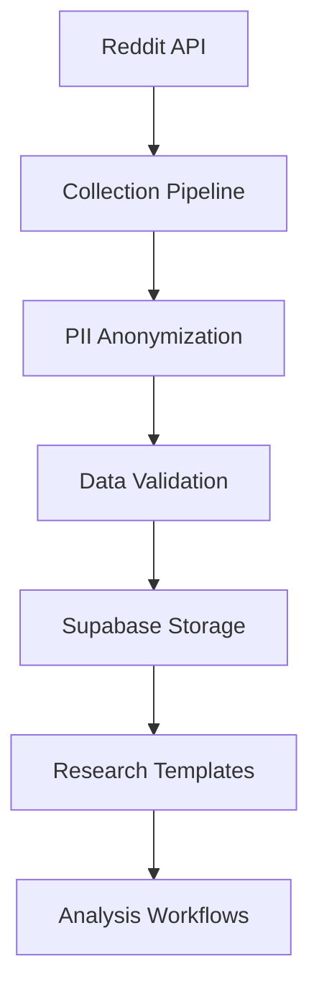

# RedditHarbor Pipeline v2 Documentation

<div align="center">


**Comprehensive Reddit Data Collection and Research Platform**

[](../LICENSE)
[](../requirements.txt)
[](#)

---

*Transforming Reddit discussions into research-ready datasets through automated collection and analysis tools with AI-agent friendly architecture*

</div>

## 📚 Table of Contents

- [🚀 Quick Start](#-quick-start)
- [📖 Documentation Structure](#-documentation-structure)
- [🔧 Implementation Guides](#-implementation-guides)
- [🏗️ Architecture & Design](#️-architecture--design)
- [🧩 Components & Systems](#-components--systems)
- [📋 Research & Development](#-research--development)
- [🎯 Guides & Tutorials](#-guides--tutorials)
- [🤝 Contributing](#-contributing)

---

## 🚀 Quick Start

New to RedditHarbor Pipeline v2? Start here:

- **[Getting Started Guide](./guides/dlt-setup-completion.md)** - Complete setup and configuration
- **[Main Pipeline Overview](./research/phase5-main-pipeline.md)** - Core pipeline functionality
- **[Implementation Details](./implementation/)** - Technical implementation guides

---

## 📖 Documentation Structure

This documentation is organized into logical sections to help you find information quickly:

### Directory Overview

```
docs/
├── README.md                    # This file - navigation hub
├── api/                         # API documentation and endpoints
├── architecture/                # System design and architecture decisions
├── components/                  # Component documentation and specifications
├── contributing/                # Contribution guidelines and standards
├── guides/                      # User guides and tutorials
├── implementation/              # Implementation details and technical guides
├── research/                    # Research notes, phase reports, and findings
└── assets/                      # Images, diagrams, and visual resources
```

---

## 🔧 Implementation Guides

**Core Implementation Documentation:**

- **[DLT to SQLAlchemy Implementation Guide](./implementation/dlt-to-sqlalchemy-implementation-guide.md)**
  - Complete migration from DLT to SQLAlchemy
  - Step-by-step implementation details
  - Code examples and best practices

- **[Wrapper Implementation Guide](./implementation/wrapper-implementation-guide.md)**
  - Data collection wrapper implementation
  - Integration patterns and workflows
  - Performance optimization techniques

---

## 🏗️ Architecture & Design

**System Architecture and Design Decisions:**

- **[DLT to SQLAlchemy Migration Technical Review](./architecture/dlt-to-sqlalchemy-migration-technical-review.md)**
  - Technical architecture review
  - Migration strategy and rationale
  - Performance implications and benchmarks

### 📊 Architecture Diagrams

<div align="center">



*High-level data flow architecture*

</div>

---

## 🧩 Components & Systems

**Component Documentation and Specifications:**

### Agent Systems
- **[Agent Characterization Summary](./components/agent-characterization-summary.md)** - Agent types and capabilities
- **[Agent Interface Specifications](./components/agent-interface-specifications.md)** - Standardized agent interfaces
- **[Agent Coordination Incident Report](./components/agent-coordination-incident-report.md)** - Coordination patterns and lessons learned

### Trust & Validation Systems
- **[Trust Validation System](./components/trust-validation-system.md)** - Data trust scoring and validation
- **[Trust Validation Interface](./components/trust-validation-interface.md)** - API interfaces for trust validation

---

## 📋 Research & Development

**Research Notes, Phase Reports, and Development Findings:**

### Phase Reports & Development
- **[Phase 5: Main Pipeline](./research/phase5-main-pipeline.md)** - Core pipeline implementation and integration
- **[Phase 4: Completion Summary](./research/phase4-completion-summary.md)** - Phase 4 achievements and outcomes
- **[Phase 3: Completion Summary](./research/phase-3-completion-summary.md)** - Phase 3 achievements and outcomes
- **[Phase 3: Code Review Report](./research/phase-3-code-review-report.md)** - Comprehensive code review findings
- **[Phase 3: Test Validation Report](./research/phase3-test-validation-report.md)** - Testing results and validation
- **[Phase 3: Final Test Results](./research/phase3-final-test-results.md)** - Complete test suite results
- **[Green Phase Completion Summary](./research/green-phase-completion-summary.md)** - Green phase achievements and metrics

### Technical Deep Dives
- **[Phase 2: Deduplication Extraction](./research/phase-2-deduplication-extraction.md)** - Data deduplication strategies and implementation
- **[Lazy Loading Implementation](./research/lazy-loading-implementation.md)** - Performance optimization through lazy loading
- **[Lazy Loading Validation Report](./research/lazy-loading-validation-report.md)** - Lazy loading testing and validation
- **[Extraction Complete](./research/extraction-complete.md)** - Data extraction pipeline completion and results

---

## 🎯 Guides & Tutorials

**Step-by-Step Guides and Tutorials:**

- **[DLT Setup Completion Guide](./guides/dlt-setup-completion.md)**
  - Complete DLT framework setup
  - Configuration and initialization
  - Testing and validation procedures

---

## 🤝 Contributing

We welcome contributions to RedditHarbor! Please see our contribution guidelines:

- **[Contribution Guidelines](./contributing/)** - Standards and procedures for contributing
- **Code Quality Standards** - Linting, formatting, and testing requirements
- **Documentation Standards** - Writing and maintaining documentation

### Quick Contribution Checklist

- [ ] Follow RedditHarbor code quality standards
- [ ] Add comprehensive tests for new features
- [ ] Update relevant documentation
- [ ] Ensure all CI checks pass
- [ ] Submit pull request with clear description

---

## 🔍 Additional Resources

### Related Documentation

- **[Main Project README](../README.md)** - Overall project information
- **[API Documentation](./api/)** - Detailed API references
- **[Configuration Guide](../config/settings.py)** - Configuration options and settings

### External Resources

- **[Reddit API Documentation](https://www.reddit.com/dev/api/)** - Official Reddit API documentation
- **[Supabase Documentation](https://supabase.com/docs)** - Database and storage platform docs
- **[DLT Documentation](https://dlthub.com/docs/)** - Data loading tool documentation

---

## 📞 Support & Contact

Need help or have questions?

- 📧 **Documentation Issues**: Create an issue in the repository
- 💬 **General Questions**: Check our discussions section
- 🐛 **Bug Reports**: Submit detailed bug reports with reproduction steps
- 🚀 **Feature Requests**: Submit feature requests with use case details

---

<div align="center">

**Built with ❤️ by the RedditHarbor Team**

*Last updated: November 2025*

[](https://cuetimer.com)

</div>