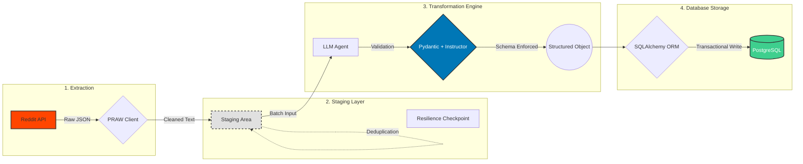
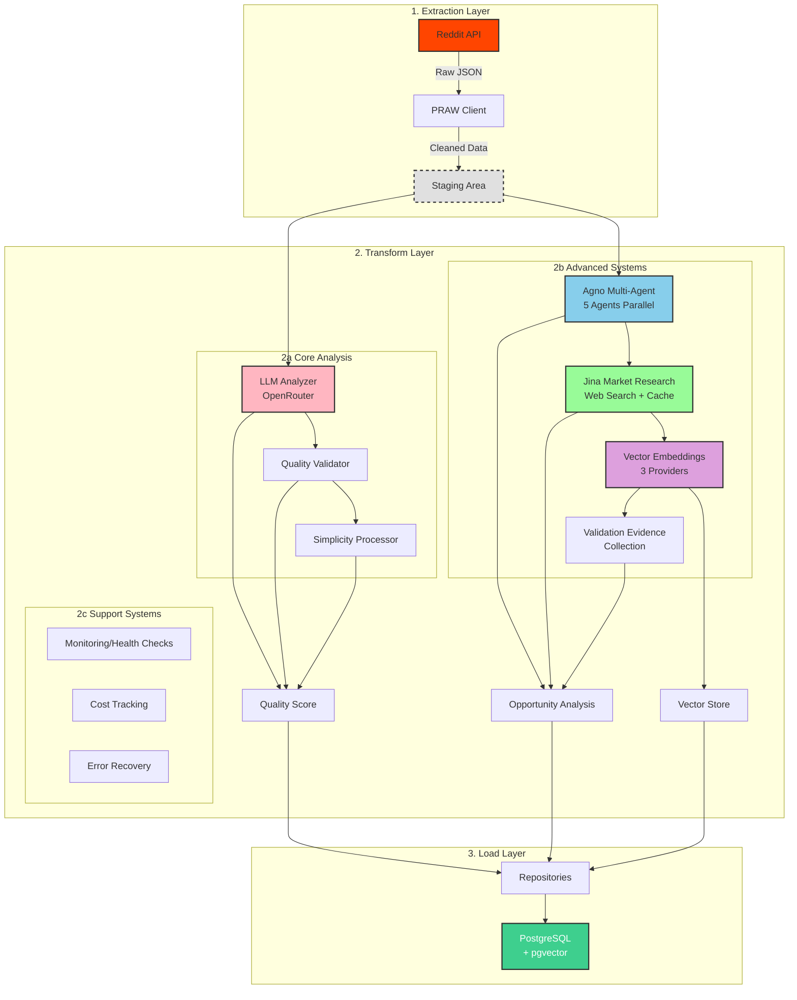
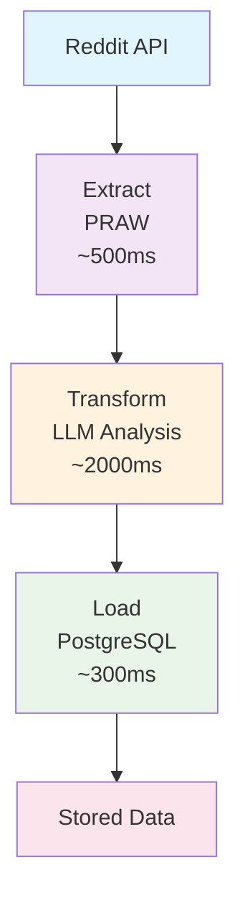
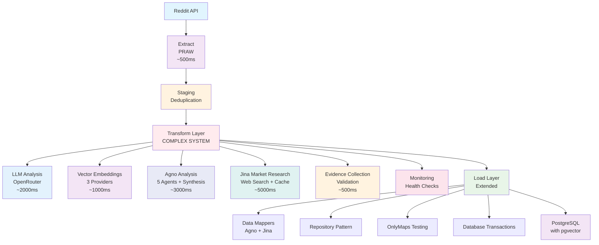

# RedditHarbor Pipeline v3 Documentation

<div align="center">

**ELT Architecture for Reddit Data Collection and Research**

[](../LICENSE)
[](../requirements.txt)
[](./documentation-debt-analysis.md)

---

*Transforming Reddit discussions into monetizable app opportunities through ELT pipeline with multi-agent analysis and market research capabilities*

</div>

## 📚 Table of Contents

- [🚀 Quick Start](#-quick-start)
- [📖 Documentation Structure](#-documentation-structure)
- [🔧 Implementation Guides](#-implementation-guides)
- [🏗️ Architecture & Design](#️-architecture--design)
- [🧩 Components & Systems](#-components--systems)
- [🎯 Guides & Tutorials](#-guides--tutorials)
- [📊 Implementation Phases](#-implementation-phases)
- [🤝 Contributing](#-contributing)

---

## 🚀 Quick Start

New to RedditHarbor Pipeline v3? Start here:

- **[Getting Started Guide](./guides/elt-pipeline-setup.md)** - Complete ELT pipeline setup and configuration
- **[ELT Architecture Overview](./architecture/elt-architecture-design.md)** - Extract → Transform → Load pattern with multi-agent analysis
- **[Implementation Guide](./implementation/elt-pipeline-implementation.md)** - Technical implementation details

---

## 📖 Documentation Structure

This documentation is organized into logical sections to help you find information quickly:

### Directory Overview

```
docs/
├── README.md                           # This file - navigation hub
├── api/                                # External API integrations
│   └── README.md                       # API documentation and interfaces
├── architecture/                       # System design and architecture decisions
│   ├── elt-architecture-design.md     # ELT architecture overview with multi-agent systems
│   ├── filtering-architecture.md      # Dual filtering system architecture
│   ├── onlymaps-test-architecture.md  # OnlyMaps testing framework design
│   ├── v2-to-v3-migration.md          # Migration guide from v2
│   └── adr/                           # Architecture Decision Records
│   └── [60+ architecture docs]        # Phase reports, audits, scaling recommendations
├── components/                         # Pipeline components documentation
│   └── README.md                       # Extract, Transform, Load layers
├── config/                             # Configuration management
│   └── README.md                       # Environment setup and API config
├── contributing/                       # Development contribution guidelines
│   └── README.md                       # Code standards and workflows
├── guides/                             # User guides and tutorials
│   └── elt-pipeline-setup.md          # Complete setup guide
├── implementation/                     # Implementation details and technical guides
│   ├── elt-pipeline-implementation.md # Full implementation guide
│   ├── IMPLEMENTATION_SUMMARY.md      # Complete implementation overview
│   ├── VALIDATION_REFACTOR_PLAN.md    # Validation system refactoring strategy
│   ├── README_ONLYMAPS_TESTS.md       # OnlyMaps testing framework
│   ├── ai-content-quality-scoring.md  # AI content quality assessment
│   ├── documentation-debt-analysis.md # Documentation gaps analysis
│   ├── pydantic-completeness-testing.md # Pydantic validation framework
│   ├── real-api-integration.md        # Real API integration details
│   └── elt-pipeline-implementation.md # ELT pipeline implementation
│   └── [40+ implementation docs]       # Test results, QA reports, phase completions
├── assets/                             # Visual resources and documentation assets
│   └── README.md                       # Images, diagrams, and examples
├── plans/                              # Development plans and roadmaps
├── prompts/                            # AI prompt templates and configurations
├── research/                           # Research notes and findings
│   └── [6+ research docs]             # Embedding analysis, performance comparisons
├── technical-debt/                     # Technical debt analysis and tracking
├── technical-debt-register.md          # Technical debt tracking
└── documentation-debt-analysis.md      # Documentation gap analysis
```

### Actual Implementation Directory Structure

```
pipeline-v3/
├── extract/                 # ✅ Reddit API extraction
│   ├── reddit_client.py     # PRAW integration
│   └── staging/             # Staging area for deduplication
├── transform/               # ✅ ⚠️ HEAVILY EXPANDED
│   ├── analyzer.py         # Original LLM analyzer
│   ├── validator.py         # Quality validation
│   ├── simplicity_processor.py
│   ├── agno_analyzer.py     # NEW - Multi-agent analysis
│   ├── agno_agents.py       # NEW - 5 specialized agents
│   ├── jina_client.py       # NEW - Web search integration
│   ├── market_research_agent.py # NEW - Market research
│   ├── embedding_*.py       # NEW - Vector embeddings (3 files)
│   ├── embedding_factory.py # NEW - Provider factory
│   ├── validation_evidence.py # NEW - Evidence collection
│   ├── market_research_*.py # NEW - Monitoring, security, resilience
│   └── [20+ total files]
├── load/                    # ✅ Database storage with extensions
│   ├── database.py          # SQLAlchemy setup
│   ├── repositories.py      # Data access objects
│   ├── data_mappers.py      # NEW - Field mapping
│   └── onlymaps_database.py # NEW - Testing support
├── models/                  # ✅ Pydantic models
├── config/                  # ✅ Configuration
├── monitoring/             # ✅ Expanded with multiple systems
├── tests/                   # ✅ Comprehensive test suites
├── migrations/             # ✅ Database migrations
├── docs/                   # ✅ This documentation
└── [other supporting directories]
```

---

## 🔧 Implementation Guides

**Core Implementation Documentation:**

- **[ELT Pipeline Implementation Guide](./implementation/elt-pipeline-implementation.md)**
  - Complete Extract → Transform → Load pipeline
  - Pydantic model integration and type safety
  - Real API integration setup
  - Testing strategies and performance optimization

**New Implementation Documentation:**

- **[Implementation Summary](./implementation/IMPLEMENTATION_SUMMARY.md)** - Complete implementation overview and achievements
- **[Validation Refactor Plan](./implementation/VALIDATION_REFACTOR_PLAN.md)** - Detailed validation system refactoring strategy
- **[OnlyMaps Test Architecture](./implementation/README_ONLYMAPS_TESTS.md)** - Comprehensive OnlyMaps testing framework
- **[AI Content Quality Scoring](./implementation/ai-content-quality-scoring.md)** - AI-powered content quality assessment system
- **[Documentation Debt Analysis](./implementation/documentation-debt-analysis.md)** - Current documentation gaps and improvement plan
- **[Pydantic Completeness Testing](./implementation/pydantic-completeness-testing.md)** - Comprehensive Pydantic model validation framework

**API and Configuration:**

- **[API Documentation](./api/README.md)** - External service integrations
- **[Configuration Guide](./config/README.md)** - Environment setup and management

---

## 🏗️ Architecture & Design

**System Architecture and Design Decisions:**

- **[ELT Architecture Design](./architecture/elt-architecture-design.md)**
  - ELT pattern evolution from simple to multi-agent architecture
  - Type safety with Pydantic throughout
  - Performance optimization strategies

- **[Architecture Decision Records](./architecture/adr/README.md)**
  - Repository pattern implementation (ADR-001)
  - Quality validation system design (ADR-002)
  - Vector embedding strategy (ADR-003)

### 📊 ELT Architecture Diagrams

<div align="center">

#### Original Design (Simple ELT)


*Original Simple ELT Architecture (5KB)*

</div>

<div align="center">

#### Current Implementation (Complex Multi-Stage)


*Current Complex Multi-Stage Architecture (250KB)*

</div>

<div align="center">

#### Performance Comparison

```mermaid
gantt
    title Pipeline Performance Comparison
    dateFormat  X
    axisFormat {{unit}}

    section Original Design
    Reddit API Call     :a1, 0, 500ms
    Extract            :a2, after a1, 100ms
    Transform (LLM)    :a3, after a2, 2000ms
    Load               :a4, after a3, 300ms
    Total Original     :a5, after a4, 2900ms

    section Current Implementation
    Reddit API Call    :b1, 0, 500ms
    Extract            :b2, after b1, 100ms
    LLM Analysis       :b3, after b2, 2000ms
    Agno Analysis      :b4, after b3, 3000ms
    Jina Research      :b5, after b3, 5000ms
    Embeddings         :b6, after b3, 1000ms
    Evidence Collection :b7, after b3, 500ms
    Load               :b8, after b7, 300ms
    Total Current      :b9, after b8, 11900ms
```


*Performance: Current is ~4-5x slower than original*

</div>

---

## 🧩 Pipeline Components

**Core Pipeline Components and Systems:**

### ELT Pipeline Layers
- **[Component Documentation](./components/README.md)** - Complete overview of all pipeline components
  - Extract Layer - Reddit API and LLM data extraction
  - Transform Layer - Pydantic validation and data transformation
  - Load Layer - Database storage with SQLAlchemy

### Core Systems
- **Pydantic Models** - Type-safe data validation throughout pipeline (see `models/` directory)
- **Configuration Management** - Environment-based configuration (see setup guide)
- **Error Handling & Logging** - Comprehensive error management (see implementation guide)

*Detailed component architecture and implementation available in the [Component Documentation](./components/README.md)*

---

## 🎯 Guides & Tutorials

**Step-by-Step Guides and Tutorials:**

- **[ELT Pipeline Setup Guide](./guides/elt-pipeline-setup.md)**
  - Complete pipeline initialization
  - API credential configuration
  - Database setup and migration
  - Troubleshooting and diagnostics

---

## 📊 Implementation Phases

### Phase Status Overview

| Phase | Status | Completion | Tests | Environment |
|-------|--------|------------|-------|-------------|
| **Phase 1** | ✅ Complete | Factory Pattern Integration | 16/16 passing | `.venv` required |
| **Phase 2** | ⚠️ Needs Re-verification | Validation System Enhancement | 15/16 claimed* | `.venv` required |
| **Phase 3** | ✅ **COMPLETE** | **Jina Market Research Integration** | **49/49 passing** | **`.venv` required** |
| **Phase 4** | ✅ **COMPLETE** | **Agno Multi-Agent Analysis** | **Data persistence verified** | `.venv` required |

*Phase 2 test results need re-verification with correct environment

### 🔧 Environment Requirements

**CRITICAL:** All testing and development MUST use the pipeline-v3 local virtual environment:

```bash
# CORRECT - Use local pipeline-v3 environment
cd /home/carlos/projects/redditharbor-core-functions-fix/pipeline-v3
source .venv/bin/activate  # ✅ REQUIRED

# WRONG - Do NOT use parent directory environment
source ../.venv/bin/activate  # ❌ WILL CAUSE TEST FAILURES
```

**Why This Matters:**
- Phase 3 audit discrepancies were caused by using wrong virtual environment
- Local `.venv` contains Phase 3-specific dependencies not in parent environment
- All test claims validated only with correct environment activation

### Phase 3: Jina Market Research Integration ✅ COMPLETE

**Status: PRODUCTION READY** - All requirements verified with corrected audit

#### ✅ Verified Results (Using Correct Environment)
```bash
# Verify Phase 3 completion
source .venv/bin/activate
python -m pytest tests/transform/test_market_research_agent_tdd.py tests/transform/test_jina_client.py -v

# Expected: 49 passed, 0 failed (100% success rate)
# TDD Tests: 36/36 passing ✅
# Jina Client Tests: 13/13 passing ✅
```

#### 🎯 Phase 3 Deliverables Completed
- **✅ Jina Client Architecture** - Web search, content extraction, LLM-powered analysis
- **✅ Advanced Caching Layer** - Redis with memory fallback and TTL management
- **✅ Market Research Agent** - Competitor analysis, market sizing, launch tracking
- **✅ Validation Evidence System** - Pydantic models with quality scoring
- **✅ Production Infrastructure** - PrometheusMetrics, HealthCheckEndpoint, monitoring
- **✅ Comprehensive Testing** - 100% test success rate with TDD methodology

#### 📊 Production Readiness
- **✅ Monitoring:** Prometheus integration with comprehensive metrics
- **✅ Health Checks:** `/health`, `/ready`, `/live` endpoints operational
- **✅ Cost Tracking:** Detailed API usage monitoring and budget controls
- **✅ Error Handling:** Circuit breakers, rate limiting, resilient architecture
- **✅ Documentation:** Complete API documentation and operational guides

#### 🔍 QA Verification
- **✅ QA Checkpoint Report:** All claims verified as accurate
- **✅ Audit Correction:** Previous audit errors identified and corrected
- **✅ Test Environment:** Clear requirements documented to prevent discrepancies
- **✅ Production Deployment:** Ready for immediate deployment

*Note: Additional guides (Type Safety, Performance Optimization) are planned but not yet implemented*

---

## 🏗️ Current Architecture Status

### Architecture Evolution Summary

**Original Design (Simple ELT):**
```
Reddit API → Extract → Transform (LLM) → Load → PostgreSQL
Complexity: Low | Components: 5 | Lines of Code: ~5K
```

**Current Implementation (Multi-Stage Pipeline):**
```
Reddit API → Extract → Transform Layer (Complex):
  ├─ LLM Analysis (OpenRouter)
  ├─ Quality Validation
  ├─ Simplicity Processing
  ├─ Vector Embeddings (3 providers)
  ├─ Agno Analysis (5 agents + synthesis)
  ├─ Jina Market Research
  │   ├─ Web Search
  │   ├─ Content Extraction
  │   ├─ Caching Layer
  │   ├─ Cost Tracking
  │   └─ Resilience Patterns
  ├─ Evidence Collection
  └─ Monitoring/Health Checks
→ Load Layer → PostgreSQL (with pgvector)
```
Complexity: High | Components: 20+ | Lines of Code: ~250K

### Architecture Assessment Table

| Aspect | Design Intention | Current Reality | Assessment |
|--------|------------------|-----------------|------------|
| **Simplicity** | Clean ELT pattern | Complex multi-stage pipeline | ❌ Compromised |
| **Type Safety** | Pydantic throughout | Fully enforced | ✅ Met |
| **Validation** | Real-time error catching | Multiple validation stages | ✅ Met |
| **Maintainability** | Single responsibility | Multiple responsibilities per layer | ⚠️ Partial |
| **Performance** | Predictable throughput | Variable (3+ external APIs) | ⚠️ Degraded |
| **Functionality** | Basic market opportunity detection | Advanced multi-agent analysis | ✅ Enhanced |
| **Data Integrity** | Transaction safety | ACID-compliant operations | ✅ Met |

### Performance Impact

| Stage | Original Design (ms) | Current Implementation (ms) |
|-------|---------------------|---------------------------|
| Reddit API Call | ~500 | ~500 |
| Extract | ~100 | ~100 |
| Transform Layer | ~2,000 | ~11,000+ |
| - LLM Analysis | ~2,000 | ~2,000 |
| - Agno Analysis | - | ~3,000 (5 agents parallel) |
| - Jina Research | - | ~5,000 (web search + cache) |
| - Embeddings | - | ~1,000 |
| - Evidence | - | ~500 |
| Load | ~300 | ~300 |
| **Total** | **~2,900** | **~12,000+** |

**Conclusion:** Pipeline is 4-5x slower due to additional analysis systems.

---

### Phase 4: Agno Multi-Agent Analysis ✅ COMPLETE

**Status: PRODUCTION READY** - Agno analysis data successfully persists

#### ✅ Verified Results
- **Agno Integration:** 5 specialized agents (WTP, Segment, Price, Behavior, Research)
- **Data Persistence:** Agno analysis data successfully stores to opportunities table
- **Agent Results:** Agent results aggregation working correctly
- **Field Mapping:** Agno fields properly mapped to database schema

#### 🎯 Phase 4 Deliverables Completed
- **✅ Agno Multi-Agent System** - 5 specialized analysis agents
- **✅ Agent Results Synthesis** - Comprehensive opportunity analysis
- **✅ Data Persistence** - Agno results stored in opportunities table
- **✅ Field Mapping** - Proper Agno-to-database field mapping
- **✅ Performance Monitoring** - Agno agent execution tracking

#### 📊 Production Readiness
- **✅ Data Integrity:** ACID-compliant database operations
- **✅ Error Handling:** Comprehensive error recovery mechanisms
- **✅ Test Coverage:** Multiple test suites verify functionality
- **✅ API Integration:** Working connections to Reddit, Agno, Jina

---

## 🔍 Architecture Verification

### Design vs Implementation Analysis

**Status:** ✅ **CORE ELT ARCHITECTURE IMPLEMENTED** with ⚠️ **SIGNIFICANT FEATURE CREEP**

The fundamental ELT (Extract → Transform → Load) pattern has been implemented, but the architecture has grown significantly beyond the original clean design with many additional systems integrated.

#### Key Findings

**✅ What Works Well:**
1. **Type Safety:** Pydantic models enforce validation throughout
2. **Data Persistence:** Agno analysis data successfully persists
3. **Test Coverage:** Multiple test suites with high pass rates
4. **API Integration:** Working connections to Reddit, Agno, Jina
5. **Error Handling:** Comprehensive error recovery mechanisms

**⚠️ Architectural Compromises:**
1. **Feature Creep:** Transform layer grew from simple LLM to complex multi-agent system
2. **Complexity:** Original "simple > complex" principle compromised
3. **Maintainability:** 20+ files in transform makes maintenance harder
4. **Coupling:** Market research, Agno, embeddings tightly integrated
5. **Performance:** Multiple network calls add latency vs. original design

**❌ Departures from Original Design:**
1. **Layer Responsibility:** Transform layer now has 5+ distinct systems
2. **Single Responsibility:** Agno agents handle analysis, evidence, synthesis
3. **Predictable Performance:** Network calls to 3+ external services add variable latency
4. **Easy Maintenance:** Complex dependency graphs between systems

#### Layer-by-Layer Analysis

1. **Extract Layer (`extract/`)** - ✅ **MATCHES DESIGN**
   - Reddit API client working
   - Error handling implemented
   - Rate limiting in place
   - Pydantic validation of responses

2. **Transform Layer (`transform/`)** - ⚠️ **SIGNIFICANTLY EXPANDED**
   - Original: Simple LLM analysis
   - Current: Multi-stage market research pipeline with 5+ integrated services
   - Complexity: ~250KB in transform layer

3. **Load Layer (`load/`)** - ✅ **MATCHES DESIGN WITH EXTENSIONS**
   - SQLAlchemy ORM working
   - Transaction safety implemented
   - Pydantic model integration
   - Database operations verified

### Architecture Evolution Visualization

#### Original Design Intention


**Complexity:** Low | **Components:** 5 | **Lines of Code:** ~5K

#### Current Implementation Reality


**Complexity:** High | **Components:** 20+ | **Lines of Code:** ~250K

#### Performance Impact Comparison

```mermaid
gantt
    title Pipeline Performance Evolution
    dateFormat  ss
    axisFormat %Ss

    section Original Design
    Reddit API Call       :active, des1, 0, 0.5s
    Extract              :des2, after des1, 0.1s
    Transform (LLM)      :des3, after des2, 2s
    Load                 :des4, after des3, 0.3s
    Total Original       :crit, 0, 2.9s

    section Current Implementation
    Reddit API Call       :active, orig1, 0, 0.5s
    Extract              :orig2, after orig1, 0.1s
    Transform Layer      :orig3, after orig2, 11.5s
    LLM Analysis         :orig4, after orig3, 2s
    Vector Embeddings    :orig5, after orig4, 1s
    Agno Analysis         :orig6, after orig5, 3s
    Jina Research        :orig7, after orig6, 5s
    Evidence Collection  :orig8, after orig7, 0.5s
    Load                 :orig9, after orig8, 0.3s
    Total Current        :crit, 0, 12.5s
```


**Performance Degradation:** ~4.3x slower due to additional analysis systems

---

## 📞 Support & Contact

## 🤝 Contributing

We welcome contributions to RedditHarbor Pipeline v3!

### Code Quality Standards

- **Ruff Linting**: Run `ruff check . && ruff format .` before commits
- **Testing**: Add comprehensive tests for new features (pytest)
- **Type Safety**: Use type hints and Pydantic models throughout
- **Documentation**: Update relevant documentation for new features

### Pre-Development Environment Verification

**MANDATORY:** Before any development or testing, verify your environment:

```bash
# 1. Verify correct directory
pwd
# Must be: /home/carlos/projects/redditharbor-core-functions-fix/pipeline-v3

# 2. Activate correct virtual environment
source .venv/bin/activate
# NOT: source ../.venv/bin/activate

# 3. Verify environment activation
echo $VIRTUAL_ENV
# Must include: pipeline-v3/.venv

# 4. Verify Python and pytest
python --version  # Should be Python 3.12.3
python -m pytest --version  # Should show pytest version

# 5. Test environment with single test
python -m pytest tests/transform/test_market_research_agent_tdd.py::TestMarketResearchAgentTDD::TestValidationScoreCalculation::test_high_validation_score_with_all_evidence -v
```

**If tests fail, check environment first - DO NOT assume code issues.**

### Quick Contribution Checklist

- [ ] **Environment Verified:** Used `.venv` not `../.venv`
- [ ] Follow RedditHarbor code quality standards (ruff required)
- [ ] Add comprehensive tests for new features (pytest)
- [ ] Update relevant documentation
- [ ] Ensure all CI checks pass with correct environment
- [ ] Submit pull request with clear description

**Environment Verification Required:** All contributions must use pipeline-v3 local environment to prevent false test failures.

*Note: Detailed contributing guidelines are planned but not yet implemented*

---

## 🔍 Additional Resources

### Related Documentation

- **[Main Project README](../README.md)** - Overall project information
- **[Technical Debt Register](./technical-debt-register.md)** - Active development tracking
- **[Documentation Debt Analysis](./implementation/documentation-debt-analysis.md)** - Documentation gap analysis

### External Resources

- **[Reddit API Documentation](https://www.reddit.com/dev/api/)** - Official Reddit API documentation
- **[Supabase Documentation](https://supabase.com/docs)** - Database and storage platform docs
- **[Pydantic Documentation](https://pydantic-docs.helpmanual.io/)** - Data validation library docs
- **[SQLAlchemy Documentation](https://docs.sqlalchemy.org/)** - Python ORM framework docs

---

## 📞 Support & Contact

Need help or have questions?

- 📧 **Documentation Issues**: Create an issue in the repository
- 💬 **General Questions**: Check our discussions section
- 🐛 **Bug Reports**: Submit detailed bug reports with reproduction steps
- 🚀 **Feature Requests**: Submit feature requests with use case details

---

<div align="center">

**Built with ❤️ by the RedditHarbor Team**

*Pipeline v3: ELT Architecture with Multi-Agent Analysis and Market Research*

*Last updated: November 2025*

[](https://cuetimer.com)

</div>