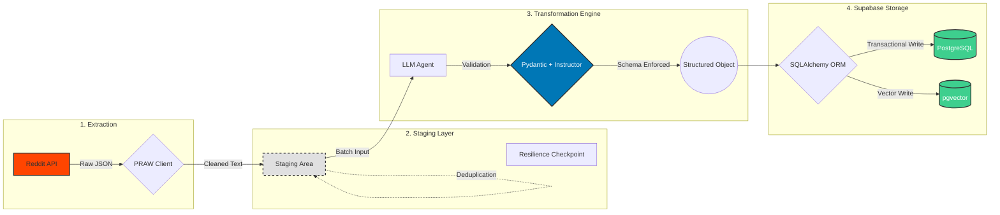

# RedditHarbor Pipeline v3 Documentation

<div align="center">

**Clean ELT Architecture for Reddit Data Collection and Research**

[](../LICENSE)
[](../requirements.txt)
[](./documentation-debt-analysis.md)

---

*Transforming Reddit discussions into monetizable app opportunities through clean ELT pipeline with full type safety*

</div>

## 📚 Table of Contents

- [🚀 Quick Start](#-quick-start)
- [📖 Documentation Structure](#-documentation-structure)
- [🔧 Implementation Guides](#-implementation-guides)
- [🏗️ Architecture & Design](#️-architecture--design)
- [🧩 Components & Systems](#-components--systems)
- [🎯 Guides & Tutorials](#-guides--tutorials)
- [🤝 Contributing](#-contributing)

---

## 🚀 Quick Start

New to RedditHarbor Pipeline v3? Start here:

- **[Getting Started Guide](./guides/elt-pipeline-setup.md)** - Complete ELT pipeline setup and configuration
- **[ELT Architecture Overview](./architecture/elt-architecture-design.md)** - Clean Extract → Transform → Load pattern
- **[Implementation Guide](./implementation/elt-pipeline-implementation.md)** - Technical implementation details

---

## 📖 Documentation Structure

This documentation is organized into logical sections to help you find information quickly:

### Directory Overview

```
docs/
├── README.md                           # This file - navigation hub
├── api/                                # External API integrations
│   └── README.md                       # API documentation and interfaces
├── architecture/                       # System design and architecture decisions
│   ├── elt-architecture-design.md     # Clean ELT architecture overview
│   ├── filtering-architecture.md      # Dual filtering system architecture
│   ├── onlymaps-test-architecture.md  # OnlyMaps testing framework design
│   ├── v2-to-v3-migration.md          # Migration guide from v2
│   └── adr/                           # Architecture Decision Records
├── components/                         # Pipeline components documentation
│   └── README.md                       # Extract, Transform, Load layers
├── config/                             # Configuration management
│   └── README.md                       # Environment setup and API config
├── contributing/                       # Development contribution guidelines
│   └── README.md                       # Code standards and workflows
├── guides/                             # User guides and tutorials
│   └── elt-pipeline-setup.md          # Complete setup guide
├── implementation/                     # Implementation details and technical guides
│   ├── elt-pipeline-implementation.md # Full implementation guide
│   ├── IMPLEMENTATION_SUMMARY.md      # Complete implementation overview
│   ├── VALIDATION_REFACTOR_PLAN.md    # Validation system refactoring strategy
│   ├── README_ONLYMAPS_TESTS.md       # OnlyMaps testing framework
│   ├── ai-content-quality-scoring.md  # AI content quality assessment
│   ├── documentation-debt-analysis.md # Documentation gaps analysis
│   ├── pydantic-completeness-testing.md # Pydantic validation framework
│   ├── real-api-integration.md        # Real API integration details
│   └── elt-pipeline-implementation.md # ELT pipeline implementation
├── assets/                             # Visual resources and documentation assets
│   └── README.md                       # Images, diagrams, and examples
├── plans/                              # Development plans and roadmaps
├── prompts/                            # AI prompt templates and configurations
├── research/                           # Research notes and findings (NEW)
├── technical-debt/                     # Technical debt analysis and tracking
├── technical-debt-register.md          # Technical debt tracking
└── documentation-debt-analysis.md      # Documentation gap analysis
```

---

## 🔧 Implementation Guides

**Core Implementation Documentation:**

- **[ELT Pipeline Implementation Guide](./implementation/elt-pipeline-implementation.md)**
  - Complete Extract → Transform → Load pipeline
  - Pydantic model integration and type safety
  - Real API integration setup
  - Testing strategies and performance optimization

**New Implementation Documentation:**

- **[Implementation Summary](./implementation/IMPLEMENTATION_SUMMARY.md)** - Complete implementation overview and achievements
- **[Validation Refactor Plan](./implementation/VALIDATION_REFACTOR_PLAN.md)** - Detailed validation system refactoring strategy
- **[OnlyMaps Test Architecture](./implementation/README_ONLYMAPS_TESTS.md)** - Comprehensive OnlyMaps testing framework
- **[AI Content Quality Scoring](./implementation/ai-content-quality-scoring.md)** - AI-powered content quality assessment system
- **[Documentation Debt Analysis](./implementation/documentation-debt-analysis.md)** - Current documentation gaps and improvement plan
- **[Pydantic Completeness Testing](./implementation/pydantic-completeness-testing.md)** - Comprehensive Pydantic model validation framework

**API and Configuration:**

- **[API Documentation](./api/README.md)** - External service integrations
- **[Configuration Guide](./config/README.md)** - Environment setup and management

---

## 🏗️ Architecture & Design

**System Architecture and Design Decisions:**

- **[ELT Architecture Design](./architecture/elt-architecture-design.md)**
  - Clean ELT pattern vs v2 complexity
  - Type safety with Pydantic throughout
  - Performance optimization strategies

- **[Architecture Decision Records](./architecture/adr/README.md)**
  - Repository pattern implementation (ADR-001)
  - Quality validation system design (ADR-002)
  - Vector embedding strategy (ADR-003)

### 📊 ELT Architecture Diagrams

<div align="center">



*Pipeline v3 Clean ELT Architecture with Staging Layer*

</div>

---

## 🧩 Pipeline Components

**Core Pipeline Components and Systems:**

### ELT Pipeline Layers
- **[Component Documentation](./components/README.md)** - Complete overview of all pipeline components
  - Extract Layer - Reddit API and LLM data extraction
  - Transform Layer - Pydantic validation and data transformation
  - Load Layer - Database storage with SQLAlchemy

### Core Systems
- **Pydantic Models** - Type-safe data validation throughout pipeline (see `models/` directory)
- **Configuration Management** - Environment-based configuration (see setup guide)
- **Error Handling & Logging** - Comprehensive error management (see implementation guide)

*Detailed component architecture and implementation available in the [Component Documentation](./components/README.md)*

---

## 🎯 Guides & Tutorials

**Step-by-Step Guides and Tutorials:**

- **[ELT Pipeline Setup Guide](./guides/elt-pipeline-setup.md)**
  - Complete pipeline initialization
  - API credential configuration
  - Database setup and migration
  - Troubleshooting and diagnostics

*Note: Additional guides (Type Safety, Performance Optimization) are planned but not yet implemented*

---

## 🤝 Contributing

We welcome contributions to RedditHarbor Pipeline v3!

### Code Quality Standards

- **Ruff Linting**: Run `ruff check . && ruff format .` before commits
- **Testing**: Add comprehensive tests for new features (pytest)
- **Type Safety**: Use type hints and Pydantic models throughout
- **Documentation**: Update relevant documentation for new features

### Quick Contribution Checklist

- [ ] Follow RedditHarbor code quality standards (ruff required)
- [ ] Add comprehensive tests for new features (pytest)
- [ ] Update relevant documentation
- [ ] Ensure all CI checks pass
- [ ] Submit pull request with clear description

*Note: Detailed contributing guidelines are planned but not yet implemented*

---

## 🔍 Additional Resources

### Related Documentation

- **[Main Project README](../README.md)** - Overall project information
- **[Technical Debt Register](./technical-debt-register.md)** - Active development tracking
- **[Documentation Debt Analysis](./implementation/documentation-debt-analysis.md)** - Documentation gap analysis

### External Resources

- **[Reddit API Documentation](https://www.reddit.com/dev/api/)** - Official Reddit API documentation
- **[Supabase Documentation](https://supabase.com/docs)** - Database and storage platform docs
- **[Pydantic Documentation](https://pydantic-docs.helpmanual.io/)** - Data validation library docs
- **[SQLAlchemy Documentation](https://docs.sqlalchemy.org/)** - Python ORM framework docs

---

## 📞 Support & Contact

Need help or have questions?

- 📧 **Documentation Issues**: Create an issue in the repository
- 💬 **General Questions**: Check our discussions section
- 🐛 **Bug Reports**: Submit detailed bug reports with reproduction steps
- 🚀 **Feature Requests**: Submit feature requests with use case details

---

<div align="center">

**Built with ❤️ by the RedditHarbor Team**

*Pipeline v3: Clean ELT Architecture with Full Type Safety*

*Last updated: November 2025*

[](https://cuetimer.com)

</div>