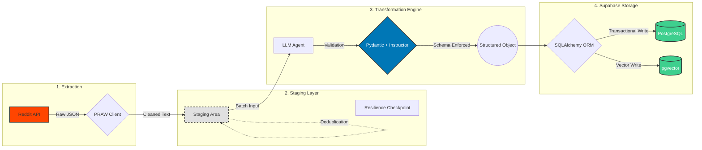

# RedditHarbor Pipeline v3 Documentation

<div align="center">


**Clean ELT Architecture for Reddit Data Collection and Research**

[](../LICENSE)
[](../requirements.txt)
[](#)

---

*Transforming Reddit discussions into monetizable app opportunities through clean ELT pipeline with full type safety*

</div>

## 📚 Table of Contents

- [🚀 Quick Start](#-quick-start)
- [📖 Documentation Structure](#-documentation-structure)
- [🔧 Implementation Guides](#-implementation-guides)
- [🏗️ Architecture & Design](#️-architecture--design)
- [🧩 Components & Systems](#-components--systems)
- [🎯 Guides & Tutorials](#-guides--tutorials)
- [🤝 Contributing](#-contributing)

---

## 🚀 Quick Start

New to RedditHarbor Pipeline v3? Start here:

- **[Getting Started Guide](./guides/elt-pipeline-setup.md)** - Complete ELT pipeline setup and configuration
- **[ELT Architecture Overview](./architecture/elt-architecture-design.md)** - Clean Extract → Transform → Load pattern
- **[Configuration Guide](./config/)** - Environment setup and API configuration

---

## 📖 Documentation Structure

This documentation is organized into logical sections to help you find information quickly:

### Directory Overview

```
docs/
├── README.md                    # This file - navigation hub
├── api/                         # API documentation and endpoints
├── architecture/                # System design and architecture decisions
├── components/                  # Component documentation and specifications
├── contributing/                # Contribution guidelines and standards
├── guides/                      # User guides and tutorials
├── implementation/              # Implementation details and technical guides
└── assets/                      # Images, diagrams, and visual resources
```

---

## 🔧 Implementation Guides

**Core Implementation Documentation:**

- **[ELT Pipeline Implementation Guide](./implementation/elt-pipeline-implementation.md)**
  - Complete Extract → Transform → Load pipeline
  - Pydantic model integration and type safety
  - Real API integration setup

- **[Real API Integration Guide](./implementation/real-api-integration.md)**
  - Reddit API integration with PRAW
  - OpenRouter LLM integration
  - Supabase database connectivity

---

## 🏗️ Architecture & Design

**System Architecture and Design Decisions:**

- **[ELT Architecture Design](./architecture/elt-architecture-design.md)**
  - Clean ELT pattern vs v2 complexity
  - Type safety with Pydantic throughout
  - Performance optimization strategies

- **[Migration from Pipeline v2](./architecture/v2-to-v3-migration.md)**
  - Architecture evolution and benefits
  - Technical debt elimination
  - Performance improvements achieved

### 📊 ELT Architecture Diagrams

<div align="center">



*Pipeline v3 Clean ELT Architecture with Staging Layer*

</div>

---

## 🧩 Components & Systems

**Component Documentation and Specifications:**

### ELT Pipeline Components
- **[Extract Layer](./components/extract-layer.md)** - Reddit API and LLM data extraction
- **[Transform Layer](./components/transform-layer.md)** - Pydantic validation and data transformation
- **[Load Layer](./components/load-layer.md)** - Database storage with SQLAlchemy

### Core Systems
- **[Pydantic Models](./components/pydantic-models.md)** - Type-safe data validation throughout pipeline
- **[Configuration Management](./components/configuration-system.md)** - Environment-based configuration
- **[Error Handling & Logging](./components/error-handling.md)** - Comprehensive error management

---

## 🎯 Guides & Tutorials

**Step-by-Step Guides and Tutorials:**

- **[ELT Pipeline Setup Guide](./guides/elt-pipeline-setup.md)**
  - Complete pipeline initialization
  - API credential configuration
  - Database setup and migration

- **[Type Safety Development Guide](./guides/type-safety-development.md)**
  - Pydantic model development
  - Type annotation best practices
  - Validation pattern implementation

- **[Performance Optimization Guide](./guides/performance-optimization.md)**
  - Batch processing optimization
  - Memory management strategies
  - Throughput improvement techniques

---

## 🤝 Contributing

We welcome contributions to RedditHarbor Pipeline v3! Please see our contribution guidelines:

- **[Contribution Guidelines](./contributing/)** - Standards and procedures for contributing
- **Code Quality Standards** - Ruff linting, formatting, and testing requirements
- **Documentation Standards** - Writing and maintaining documentation

### Quick Contribution Checklist

- [ ] Follow RedditHarbor code quality standards (ruff required)
- [ ] Add comprehensive tests for new features (pytest)
- [ ] Update relevant documentation
- [ ] Ensure all CI checks pass
- [ ] Submit pull request with clear description

---

## 🔍 Additional Resources

### Related Documentation

- **[Main Project README](../README.md)** - Overall project information
- **[API Documentation](./api/)** - Detailed API references
- **[Configuration Guide](../config/)** - Configuration options and settings

### External Resources

- **[Reddit API Documentation](https://www.reddit.com/dev/api/)** - Official Reddit API documentation
- **[Supabase Documentation](https://supabase.com/docs)** - Database and storage platform docs
- **[Pydantic Documentation](https://pydantic-docs.helpmanual.io/)** - Data validation library docs
- **[SQLAlchemy Documentation](https://docs.sqlalchemy.org/)** - Python ORM framework docs

---

## 📞 Support & Contact

Need help or have questions?

- 📧 **Documentation Issues**: Create an issue in the repository
- 💬 **General Questions**: Check our discussions section
- 🐛 **Bug Reports**: Submit detailed bug reports with reproduction steps
- 🚀 **Feature Requests**: Submit feature requests with use case details

---

<div align="center">

**Built with ❤️ by the RedditHarbor Team**

*Pipeline v3: Clean ELT Architecture with Full Type Safety*

*Last updated: November 2025*

[](https://cuetimer.com)

</div>