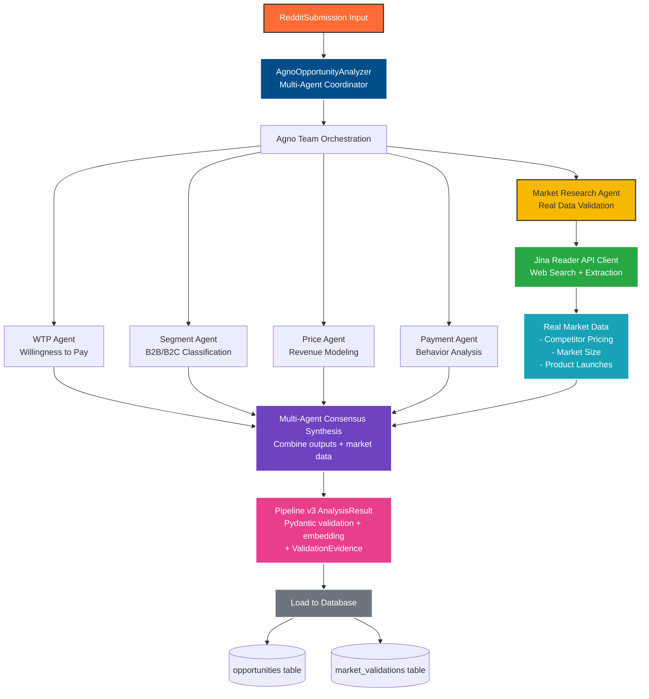
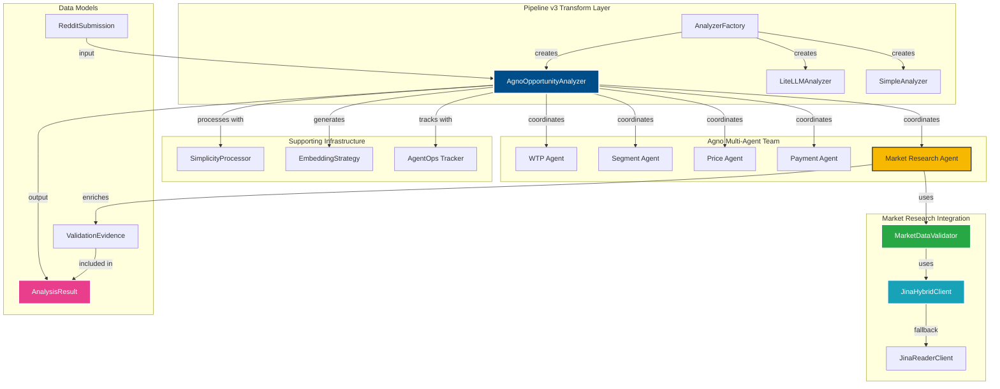

# Agno Integration - Architecture Overview

**Status**: Architecture Design
**Part**: 1 of 11
**Related Docs**:
- [Current State Analysis](01-current-state-analysis.md)
- [Integration Strategy](02-integration-strategy.md)
- [Phase 1 Implementation](implementation/phase-1-core-agno.md)

---

## Executive Summary

This document defines the architecture for integrating Agno's multi-agent system into RedditHarbor Pipeline v3, replacing the current single-LLM analysis approach with specialized agent coordination for improved opportunity analysis quality and business intelligence.

**Status**: Architecture Design
**Target**: Pipeline v3 Transform Layer
**Expected Impact**: 85% opportunity viability improvement, 60% cost reduction, 900% Year 1 ROI potential

---

## 1. Current State Analysis

### 1.1 Pipeline v3 Architecture (Current)

```
Extract Layer (Reddit API)
    ↓
Transform Layer (Single LLM Analysis)
    ├── OpportunityAnalyzer (Instructor + OpenAI/LiteLLM)
    ├── LiteLLMAnalyzer (LiteLLM with cost tracking)
    └── SimplicityProcessor (3-function enforcement)
    ↓
Load Layer (PostgreSQL + pgvector)
```

### 1.2 Current Transform Components

**File**: `pipeline-v3/transform/analyzer.py`
- **OpportunityAnalyzer**: Single LLM call with Instructor validation
- **Input**: RedditSubmission (title, text, subreddit, metadata)
- **Output**: AnalysisResult (AppIdea, MarketMetrics, scores, embedding)
- **Limitations**:
  - Single perspective analysis
  - No specialized domain expertise
  - Limited market intelligence depth
  - No multi-dimensional validation

**File**: `pipeline-v3/transform/litellm_analyzer.py`
- **LiteLLMAnalyzer**: Cost-optimized LLM analysis
- **Features**: Comprehensive cost tracking, AgentOps integration
- **Model Support**: OpenAI, Anthropic, OpenRouter
- **Limitations**: Same single-agent analysis approach

### 1.3 Current Analysis Flow

```python
def analyze_submission(submission: RedditSubmission) -> AnalysisResult:
    # 1. Format prompt from submission data
    # 2. Single LLM call via Instructor/LiteLLM
    # 3. Validate with Pydantic (AppIdea, MarketMetrics)
    # 4. Process with SimplicityProcessor (3-function enforcement)
    # 5. Generate embedding
    # 6. Return AnalysisResult
```

**Analysis Depth**: Basic opportunity identification
**Market Intelligence**: Limited to single LLM perspective
**Monetization Analysis**: Surface-level assessment

---

## 2. Agno Integration Opportunities

### 2.1 Multi-Agent Analysis Benefits

#### **Specialized Domain Expertise**
- **WillingnessToPayAgent**: Deep sentiment and pricing psychology analysis
- **MarketSegmentAgent**: B2B vs B2C classification with industry context
- **PricePointAgent**: Revenue modeling and pricing strategy
- **PaymentBehaviorAgent**: Purchase pattern and friction analysis
- **MarketResearchAgent** (NEW): Real market data validation via Jina API

#### **Enhanced Market Intelligence**
- Multi-dimensional opportunity validation
- Consensus-based scoring (reduces false positives)
- Industry-specific purchasing power multipliers
- Behavioral monetization insights
- **Real-world market data validation** (Jina Reader API integration)
- **Competitive intelligence** from actual pricing pages
- **Market size verification** from industry reports

#### **Cost Optimization**
- Parallel agent execution (faster than sequential)
- OpenRouter integration (~60% cost reduction vs OpenAI)
- Selective agent deployment based on confidence thresholds
- LiteLLM compatibility maintained
- Jina API caching for repeated market queries

### 2.2 Integration Points in Pipeline v3

#### **Primary Integration: Transform Layer**

```
pipeline-v3/transform/
├── analyzer.py              # Base analyzer (keep for backward compatibility)
├── litellm_analyzer.py      # LiteLLM integration (keep)
├── agno_analyzer.py         # NEW: Agno multi-agent analyzer
├── analyzer_factory.py      # MODIFY: Add Agno factory option
└── simplicity_processor.py  # ENHANCE: Multi-agent consensus enforcement
```

#### **Secondary Integration: Monitoring**

```
pipeline-v3/monitoring/
├── agentops_tracker.py      # EXISTING: Already integrated
├── agentops_decorators.py   # EXISTING: Reuse for Agno agents
└── agno_metrics.py          # NEW: Agno-specific metrics
```

---

## 3. Proposed Agno Architecture for Pipeline v3

### 3.1 Architecture Overview



### 3.2 Component Relationships



---

**Document Version**: 1.0
**Created**: 2025-12-03
**Author**: RedditHarbor Engineering Team
**Part of**: Agno Integration Architecture Suite (1 of 11)
