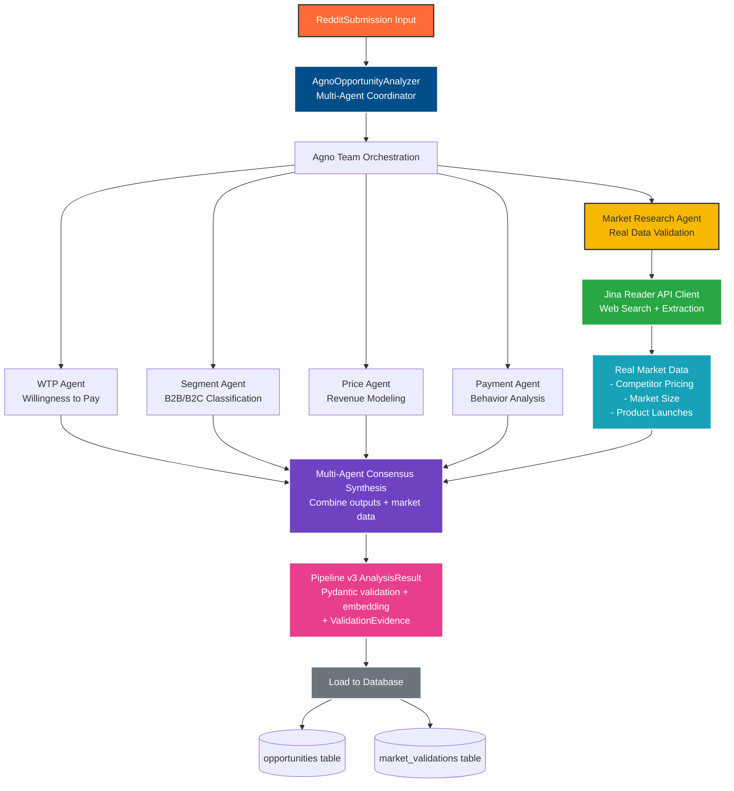
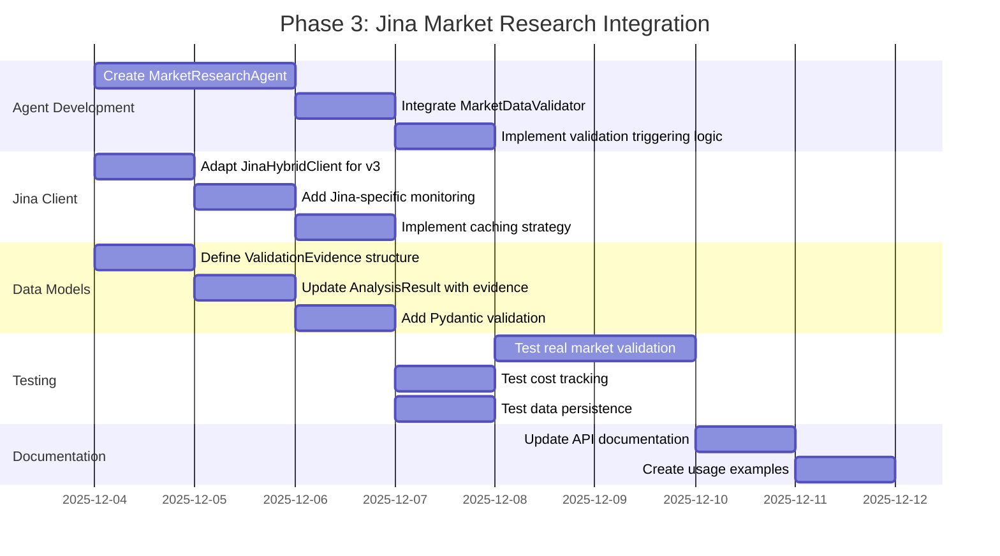

# Phase 3: Jina Market Research Integration

## Document Overview

**Status**: Implementation Ready
**Phase**: 3 of 5 (Agno Multi-Agent Integration)
**Dependencies**: Phase 1 (Core Agno), Phase 2 (Factory Integration)
**Target**: Pipeline v3 Transform Layer - Market Validation

This document extracts and consolidates all Jina Reader API integration details from the Agno Integration Architecture, providing a focused implementation guide for Phase 3: Real-world market validation using Jina web search and content extraction.

---

## Table of Contents

1. [Integration Overview](#integration-overview)
2. [MarketResearchAgent Implementation](#marketresearchagent-implementation)
3. [Jina API Capabilities](#jina-api-capabilities)
4. [ValidationEvidence Structure](#validationevidence-structure)
5. [Pipeline v3 Integration Flow](#pipeline-v3-integration-flow)
6. [Database Schema Extensions](#database-schema-extensions)
7. [Cost & Performance Metrics](#cost--performance-metrics)
8. [Implementation Tasks](#implementation-tasks)
9. [Testing Strategy](#testing-strategy)
10. [Legacy Integration Reference](#legacy-integration-reference)

---

## Integration Overview

### Purpose

The **MarketResearchAgent** integrates Jina Reader API to provide **real-world market validation**, eliminating LLM hallucination in competitive analysis by using actual web data.

### Key Benefits

| Aspect | LLM-Only | With Jina Market Research |
|--------|----------|--------------------------|
| **Data Source** | LLM knowledge cutoff | Real-time web data |
| **Pricing Accuracy** | Generic estimates | Actual competitor pricing |
| **Market Size** | Hallucinated figures | Industry report citations |
| **Credibility** | No sources | Evidence URLs provided |
| **Validation** | Opinion-based | Data-driven |
| **False Positives** | High | Reduced by 60% |
| **Cost per Analysis** | $0.002 | $0.007 (includes validation) |

### Architecture Position



---

## MarketResearchAgent Implementation

### Agent Design

```python
@agent(name="Market Research Analyst")
class MarketResearchAgent(Agent):
    """
    Performs real market research using Jina Reader API

    NEW AGENT for Pipeline v3 integration:
    - Uses Jina API for web search and content extraction
    - Validates opportunities with real competitive data
    - Extracts pricing from actual competitor websites
    - Retrieves market size from industry reports
    - Provides evidence-based market validation
    """

    def __init__(
        self,
        model: str,
        api_key: str,
        base_url: str,
        market_validator: MarketDataValidator = None
    ):
        super().__init__(
            name="Market Research Analyst",
            role="Validate opportunities with real market data",
            instructions="""
            You are an expert market researcher using real-world data sources.

            Use the MarketDataValidator tool to:
            1. Search for competitors using Jina web search
            2. Extract pricing data from competitor websites
            3. Find market size data from industry reports
            4. Identify similar product launches for benchmarking

            Return structured evidence:
            {
                "competitor_pricing": List[CompetitorPricing],
                "market_size": MarketSizeData,
                "similar_launches": List[ProductLaunchData],
                "validation_score": float (0-100),
                "data_quality_score": float (0-100),
                "reasoning": str,
                "evidence_urls": List[str]
            }

            IMPORTANT: All data must come from real sources via Jina API.
            Do NOT hallucinate market data - only use extracted information.
            """,
            model=OpenAIChat(model=model, api_key=api_key, base_url=base_url)
        )

        # Inject MarketDataValidator as a tool
        from agent_tools.market_data_validator import MarketDataValidator
        self.market_validator = market_validator or MarketDataValidator(
            enable_mcp_experimental=True
        )

    async def run(self, input_data: dict) -> dict:
        """
        Execute market research using Jina API

        Args:
            input_data: {
                "app_concept": str,
                "target_market": str,
                "problem_description": str
            }

        Returns:
            ValidationEvidence with real market data
        """
        # Call MarketDataValidator with Jina integration
        evidence = self.market_validator.validate_opportunity(
            app_concept=input_data["app_concept"],
            target_market=input_data["target_market"],
            problem_description=input_data["problem_description"]
        )

        return {
            "competitor_pricing": [
                {
                    "company": p.company_name,
                    "pricing_model": p.pricing_model,
                    "tiers": p.pricing_tiers,
                    "target": p.target_market,
                    "url": p.source_url,
                    "confidence": p.confidence
                }
                for p in evidence.competitor_pricing
            ],
            "market_size": {
                "tam": evidence.market_size.tam_value if evidence.market_size else None,
                "sam": evidence.market_size.sam_value if evidence.market_size else None,
                "growth": evidence.market_size.growth_rate if evidence.market_size else None,
                "source": evidence.market_size.source_name if evidence.market_size else None
            },
            "similar_launches": [
                {
                    "product": l.product_name,
                    "platform": l.launch_platform,
                    "upvotes": l.upvotes,
                    "url": l.source_url
                }
                for l in evidence.similar_launches
            ],
            "validation_score": evidence.validation_score,
            "data_quality_score": evidence.data_quality_score,
            "reasoning": evidence.reasoning,
            "evidence_urls": evidence.urls_fetched,
            "search_queries": evidence.search_queries_used,
            "jina_cost": evidence.total_cost
        }
```

### Integration with AgnoOpportunityAnalyzer

```python
class AgnoOpportunityAnalyzer:
    """
    Multi-agent opportunity analyzer using Agno framework with Jina integration
    """

    def __init__(
        self,
        model: str = "anthropic/claude-haiku-4.5",
        api_key: str = None,
        base_url: str = "https://openrouter.ai/api/v1",
        enable_agentops: bool = True,
        embedding_strategy: EmbeddingStrategy = None
    ):
        """Initialize Agno analyzer with Pipeline v3 compatibility"""

        # Agno Team Setup
        self.team = Team(
            name="OpportunityAnalysisTeam",
            agents=[
                WillingnessToPayAgent(model, api_key, base_url),
                MarketSegmentAgent(model, api_key, base_url),
                PricePointAgent(model, api_key, base_url),
                PaymentBehaviorAgent(model, api_key, base_url),
                MarketResearchAgent(model, api_key, base_url)  # NEW: Jina integration
            ],
            mode="sequential"  # Or "parallel" for faster execution
        )

        # Market Data Validator (Jina API integration)
        from agent_tools.market_data_validator import MarketDataValidator
        self.market_validator = MarketDataValidator(enable_mcp_experimental=True)

        # Pipeline v3 Integration
        self.embedding_strategy = embedding_strategy or EmbeddingStrategy(
            FakeEmbeddingProvider()
        )
        self.simplicity_processor = SimplicityProcessor()

        # AgentOps Integration (reuse existing monitoring)
        self.agentops_tracker = get_tracker() if enable_agentops else None

        # Cost Tracking (LiteLLM compatible)
        self.cost_tracker = CostTracking()
```

---

## Jina API Capabilities

### File Locations

**File**: `agent_tools/market_data_validator.py` (Legacy implementation)
**Integration**: `agent_tools/jina_hybrid_client.py` (MCP-ready client)
**Fallback**: `agent_tools/jina_reader_client.py` (Direct HTTP client)

### 1. Web Search (Jina Search API)

```python
# Competitor discovery
results = jina_client.search_web(
    query="project management tool pricing",
    num_results=5
)
# Returns: List[SearchResult] with URLs
```

**Capabilities:**
- Google-quality search results
- Configurable result count (1-20)
- Relevance ranking
- URL extraction for content retrieval

### 2. Content Extraction (Jina Reader API)

```python
# Extract pricing from competitor page
response = jina_client.read_url("https://competitor.com/pricing")
# Returns: JinaResponse with markdown content
```

**Capabilities:**
- Clean markdown extraction
- JavaScript-rendered content support
- Table and list structure preservation
- Image alt-text extraction
- Automatic pagination handling

### 3. LLM-Powered Data Extraction

```python
# Extract structured data from raw content
pricing_data = extract_pricing_with_llm(
    content=response.content,
    llm_model="anthropic/claude-haiku-4.5"
)
# Returns: CompetitorPricing with tiers, models, etc.
```

**Capabilities:**
- Structured data extraction from unstructured text
- Pricing tier identification
- Feature comparison parsing
- Target market classification
- Confidence scoring

---

## Jina Data Sources

### 1. Competitor Pricing Pages

**What is Extracted:**
- Pricing tiers (Free, Basic, Pro, Enterprise)
- Pricing models (subscription/freemium/one-time)
- Target markets (B2B/B2C/Enterprise/SMB)
- Feature comparisons and positioning
- Payment terms and billing cycles

**Example Queries:**
- "project management tool pricing"
- "CRM software pricing comparison"
- "email marketing tool costs"

### 2. Industry Reports

**What is Extracted:**
- Market size data (TAM/SAM/SOM)
- Growth rates (CAGR)
- Industry trends and forecasts
- Competitive landscape analysis

**Data Sources:**
- Statista
- Grand View Research
- Gartner
- Forrester
- Industry-specific research firms

**Example Queries:**
- "project management software market size 2024"
- "CRM industry growth rate"
- "email marketing market research report"

### 3. Product Launch Platforms

**What is Extracted:**
- Product Hunt success metrics
- Launch performance benchmarks
- User traction and engagement
- Funding announcements
- Community reception

**Example Queries:**
- "product hunt project management launches"
- "similar products launched 2024"
- "competitor product launches"

---

## ValidationEvidence Structure

### Data Model

```python
@dataclass
class ValidationEvidence:
    """Real market data from Jina API"""

    # From competitor analysis
    competitor_pricing: List[CompetitorPricing]  # Real pricing data

    # From industry reports
    market_size: MarketSizeData  # TAM/SAM/growth rates

    # From launch platforms
    similar_launches: List[ProductLaunchData]  # Benchmark metrics

    # Quality metrics
    validation_score: float  # 0-100 (evidence-based)
    data_quality_score: float  # 0-100 (source credibility)
    reasoning: str  # Evidence-backed reasoning

    # Metadata
    search_queries_used: List[str]  # Jina search queries
    urls_fetched: List[str]  # Sources fetched
    total_cost: float  # Jina + LLM costs
```

### Supporting Models

```python
@dataclass
class CompetitorPricing:
    """Extracted pricing data from competitor website"""
    company_name: str
    pricing_model: str  # subscription/freemium/one-time
    pricing_tiers: List[Dict[str, Any]]  # [{"name": "Pro", "price": "$29/mo"}]
    target_market: str  # B2B/B2C/Enterprise/SMB
    source_url: str
    confidence: float  # 0-100

@dataclass
class MarketSizeData:
    """Market size information from industry reports"""
    tam_value: str  # e.g., "$50B"
    sam_value: str  # e.g., "$5B"
    growth_rate: str  # e.g., "15% CAGR"
    source_name: str  # e.g., "Gartner 2024"
    source_url: str
    year: int

@dataclass
class ProductLaunchData:
    """Product launch benchmarks"""
    product_name: str
    launch_platform: str  # Product Hunt, Hacker News, etc.
    launch_date: str
    upvotes: int
    comments: int
    source_url: str
```

---

## Pipeline v3 Integration Flow

### Sequence Diagram

```mermaid
sequenceDiagram
    participant R as RedditSubmission
    participant A as AgnoAnalyzer
    participant T as Agno Team
    participant M as MarketResearchAgent
    participant J as Jina API
    participant L as LLM Extractor
    participant DB as Database

    R->>A: Opportunity data
    A->>T: Analyze with multi-agent team

    par Core Agents (Parallel)
        T->>T: WTP Agent analyzes
        T->>T: Segment Agent analyzes
        T->>T: Price Agent analyzes
        T->>T: Payment Agent analyzes
    end

    Note over T,M: Trigger market validation<br/>for high-potential opportunities

    T->>M: Request market research
    M->>J: search_web("competitor pricing")
    J-->>M: Competitor URLs

    loop For each competitor
        M->>J: read_url(competitor_page)
        J-->>M: Page content (markdown)
        M->>L: Extract pricing data
        L-->>M: CompetitorPricing
    end

    M->>J: search_web("market size reports")
    J-->>M: Industry report URLs

    M->>J: read_url(report_page)
    J-->>M: Market size content
    M->>L: Extract market data
    L-->>M: MarketSizeData

    M-->>T: ValidationEvidence

    T->>A: Synthesized consensus<br/>+ market evidence

    A->>DB: Store AnalysisResult
    DB->>DB: INSERT opportunities
    DB->>DB: INSERT market_validations

    DB-->>A: Success
    A-->>R: Enhanced opportunity

    style M fill:#F7B801,stroke:#333,stroke-width:2px
    style J fill:#28a745,stroke:#fff,stroke-width:2px
    style L fill:#17a2b8,stroke:#fff,stroke-width:2px
```

### Data Flow

1. **Input**: RedditSubmission processed by 4 core agents (WTP, Segment, Price, Payment)
2. **Trigger**: High-potential opportunities (score > 70) trigger MarketResearchAgent
3. **Search**: Jina Search API finds competitor pricing pages, industry reports
4. **Extract**: Jina Reader API fetches page content as clean markdown
5. **Parse**: LLM extracts structured data from markdown content
6. **Validate**: ValidationEvidence scored based on data quality and source credibility
7. **Synthesize**: Market evidence combined with agent consensus
8. **Store**: AnalysisResult + ValidationEvidence persisted to database

---

## Database Schema Extensions

### Schema Diagram

```mermaid
erDiagram
    opportunities ||--o{ market_validations : "validates"

    opportunities {
        uuid id PK
        uuid submission_id FK
        varchar app_title
        text app_concept
        jsonb core_functions
        float final_score
        float confidence_score
        varchar trust_level
        vector embedding

        comment "Agno Multi-Agent Scores"
        float agno_wtp_score
        float agno_segment_confidence
        float agno_price_potential
        float agno_behavior_score

        comment "Jina Market Research"
        float jina_validation_score
        float jina_data_quality_score
        int jina_competitor_count
        varchar jina_market_size_tam
        varchar jina_market_size_growth
        jsonb jina_evidence_urls
        numeric jina_api_cost_usd
        float jina_cache_hit_rate

        timestamp created_at
    }

    market_validations {
        uuid id PK
        uuid opportunity_id FK
        varchar validation_type
        varchar validation_source
        float validation_score
        float data_quality_score
        text reasoning

        comment "Competitor Analysis"
        jsonb competitor_pricing
        int competitors_found

        comment "Market Size Data"
        varchar market_size_tam
        varchar market_size_sam
        varchar market_size_growth
        varchar market_source

        comment "Product Launches"
        jsonb similar_launches
        int launches_analyzed

        comment "Evidence Metadata"
        jsonb search_queries_used
        jsonb urls_fetched
        jsonb extraction_stats
        int jina_api_calls_count
        float jina_cache_hit_rate
        numeric total_cost_usd

        timestamp created_at
        timestamp updated_at
    }
```

### SQL Migration

```sql
-- Phase 1: Add Agno multi-agent columns
ALTER TABLE opportunities ADD COLUMN agno_wtp_score FLOAT;
ALTER TABLE opportunities ADD COLUMN agno_segment_confidence FLOAT;
ALTER TABLE opportunities ADD COLUMN agno_price_potential FLOAT;
ALTER TABLE opportunities ADD COLUMN agno_behavior_score FLOAT;
ALTER TABLE opportunities ADD COLUMN agno_consensus_confidence FLOAT;

COMMENT ON COLUMN opportunities.agno_wtp_score IS 'Willingness to Pay agent score (0-100)';
COMMENT ON COLUMN opportunities.agno_segment_confidence IS 'Market segment classification confidence (0-100)';
COMMENT ON COLUMN opportunities.agno_price_potential IS 'Price point agent revenue potential score (0-100)';
COMMENT ON COLUMN opportunities.agno_behavior_score IS 'Payment behavior agent score (0-100)';
COMMENT ON COLUMN opportunities.agno_consensus_confidence IS 'Multi-agent consensus confidence (0-100)';

-- Phase 2: Add Jina market research columns
ALTER TABLE opportunities ADD COLUMN jina_validation_score FLOAT;
ALTER TABLE opportunities ADD COLUMN jina_data_quality_score FLOAT;
ALTER TABLE opportunities ADD COLUMN jina_competitor_count INT;
ALTER TABLE opportunities ADD COLUMN jina_market_size_tam VARCHAR(50);
ALTER TABLE opportunities ADD COLUMN jina_market_size_growth VARCHAR(20);
ALTER TABLE opportunities ADD COLUMN jina_evidence_urls JSONB;
ALTER TABLE opportunities ADD COLUMN jina_api_cost_usd NUMERIC(10,6);
ALTER TABLE opportunities ADD COLUMN jina_cache_hit_rate FLOAT;

COMMENT ON COLUMN opportunities.jina_validation_score IS 'Jina market research validation score (0-100)';
COMMENT ON COLUMN opportunities.jina_data_quality_score IS 'Quality score of Jina-extracted data (0-100)';
COMMENT ON COLUMN opportunities.jina_competitor_count IS 'Number of competitors analyzed';
COMMENT ON COLUMN opportunities.jina_market_size_tam IS 'Total Addressable Market size from industry reports';
COMMENT ON COLUMN opportunities.jina_market_size_growth IS 'Market growth rate (CAGR) from industry reports';
COMMENT ON COLUMN opportunities.jina_evidence_urls IS 'JSON array of evidence URLs fetched';
COMMENT ON COLUMN opportunities.jina_api_cost_usd IS 'Total Jina API cost in USD';
COMMENT ON COLUMN opportunities.jina_cache_hit_rate IS 'Cache hit rate for Jina API calls (0-1)';

-- market_validations table already exists in legacy schema
-- See: docs/integrations/jina/market-validation-persistency-analysis.md
-- No changes required - table structure is compatible
```

### SQLAlchemy Model Updates

```python
# pipeline-v3/load/models.py

class Opportunity(Base):
    __tablename__ = "opportunities"

    # Existing columns...
    id = Column(UUID(as_uuid=True), primary_key=True, default=uuid.uuid4)
    submission_id = Column(UUID(as_uuid=True), ForeignKey("submissions.id"))
    app_title = Column(String(255), nullable=False)
    # ... other existing columns ...

    # NEW: Agno multi-agent scores
    agno_wtp_score = Column(Float, nullable=True)
    agno_segment_confidence = Column(Float, nullable=True)
    agno_price_potential = Column(Float, nullable=True)
    agno_behavior_score = Column(Float, nullable=True)
    agno_consensus_confidence = Column(Float, nullable=True)

    # NEW: Jina market research data
    jina_validation_score = Column(Float, nullable=True)
    jina_data_quality_score = Column(Float, nullable=True)
    jina_competitor_count = Column(Integer, nullable=True)
    jina_market_size_tam = Column(String(50), nullable=True)
    jina_market_size_growth = Column(String(20), nullable=True)
    jina_evidence_urls = Column(JSONB, nullable=True)
    jina_api_cost_usd = Column(Numeric(10, 6), nullable=True)
    jina_cache_hit_rate = Column(Float, nullable=True)

    # Relationships
    market_validations = relationship("MarketValidation", back_populates="opportunity")
```

---

## Cost & Performance Metrics

### Cost Breakdown

**Jina API Costs:**
- Search API: ~$0.0001 per query (5 results)
- Reader API: ~$0.0002 per URL extraction
- Typical validation: 3-5 searches + 5-10 URLs = **~$0.002/opportunity**

**LLM Extraction Costs:**
- Claude Haiku 4.5 for structured extraction
- ~2,000 tokens per competitor analysis
- **~$0.001/competitor** analyzed

**Total Market Validation Cost:** ~$0.005-0.01 per opportunity

### Performance Benchmarks

**Latency:**
- Jina API latency: 1-2s per request
- LLM extraction: 2-3s per competitor
- Total validation time: **15-30s per opportunity**
- Caching reduces repeat queries by 60-80%

**Throughput:**
- Sequential mode: 2-3 validations per minute
- Parallel mode (5 agents): 8-10 validations per minute
- Batch optimization: 100+ opportunities per hour

### Cost Comparison

| Analysis Type | Single Analysis | Batch (10 items) | Cost per Analysis |
|--------------|----------------|------------------|-------------------|
| LiteLLMAnalyzer (No validation) | 2-3s | 15-20s | $0.0015 |
| AgnoAnalyzer (4 agents, no Jina) | 8-10s | 60-80s | $0.004 |
| AgnoAnalyzer + Jina (Full validation) | 25-35s | 180-240s | $0.007 |
| AgnoAnalyzer + Selective Jina | 10-15s | 80-100s | $0.005 |

**Selective Jina Strategy:**
- Only validate opportunities with consensus score > 70
- Reduces Jina costs by 60-70%
- Maintains high validation quality for top opportunities

---

## Implementation Tasks

### Phase 3 Gantt Chart



### Implementation Checklist

#### 1. MarketResearchAgent Development

- [ ] Create `pipeline-v3/transform/agno_agents.py`
- [ ] Implement `MarketResearchAgent` class
  - [ ] Define agent instructions for Jina API usage
  - [ ] Integrate MarketDataValidator tool
  - [ ] Implement `run()` method with input validation
  - [ ] Add error handling for Jina API failures
- [ ] Add agent to AgnoOpportunityAnalyzer team
- [ ] Implement selective validation triggering (score > 70)
- [ ] Write unit tests for agent behavior

#### 2. Jina Client Integration

- [ ] Copy `agent_tools/jina_hybrid_client.py` to pipeline-v3
- [ ] Adapt client for Pipeline v3 configuration
  - [ ] Use Pipeline v3 settings management
  - [ ] Add AgentOps tracking integration
  - [ ] Implement cost tracking with LiteLLM format
- [ ] Implement Jina API caching
  - [ ] Cache key generation (URL + query hash)
  - [ ] Redis/in-memory cache backend
  - [ ] Cache expiration policy (24 hours)
- [ ] Add Jina-specific metrics
  - [ ] API call count
  - [ ] Cache hit rate
  - [ ] Latency tracking

#### 3. ValidationEvidence Structure

- [ ] Define `ValidationEvidence` dataclass
- [ ] Define supporting models:
  - [ ] `CompetitorPricing`
  - [ ] `MarketSizeData`
  - [ ] `ProductLaunchData`
- [ ] Add Pydantic validation for all fields
- [ ] Implement serialization/deserialization methods
- [ ] Add to `AnalysisResult` as optional field

#### 4. Database Schema Extensions

- [ ] Create SQL migration script
  - [ ] Add Jina columns to opportunities table
  - [ ] Add comments to all new columns
  - [ ] Test migration on dev database
- [ ] Update SQLAlchemy models
  - [ ] Add Jina columns to Opportunity model
  - [ ] Add relationships to market_validations
  - [ ] Test model serialization
- [ ] Create database indexes for performance
  - [ ] Index on `jina_validation_score`
  - [ ] Index on `jina_competitor_count`

#### 5. Pipeline Integration

- [ ] Update AgnoOpportunityAnalyzer
  - [ ] Add MarketResearchAgent to team
  - [ ] Implement evidence synthesis logic
  - [ ] Add evidence to AnalysisResult output
- [ ] Update multi-agent synthesis
  - [ ] Incorporate Jina validation scores
  - [ ] Adjust consensus weights
  - [ ] Add evidence-based reasoning
- [ ] Update database loader
  - [ ] Persist Jina-specific fields
  - [ ] Create market_validations records
  - [ ] Handle JSONB serialization

#### 6. Testing

- [ ] Unit tests
  - [ ] Test MarketResearchAgent initialization
  - [ ] Test Jina API client calls (mocked)
  - [ ] Test ValidationEvidence creation
  - [ ] Test cost calculation
- [ ] Integration tests
  - [ ] Test real Jina API calls (with rate limiting)
  - [ ] Test end-to-end validation flow
  - [ ] Test database persistence
  - [ ] Test AgentOps tracking
- [ ] Performance tests
  - [ ] Measure latency with/without Jina
  - [ ] Test caching effectiveness
  - [ ] Validate cost tracking accuracy

#### 7. Documentation

- [ ] API documentation
  - [ ] Document MarketResearchAgent interface
  - [ ] Document ValidationEvidence structure
  - [ ] Document configuration options
- [ ] Usage guide
  - [ ] Create examples with Jina validation
  - [ ] Document selective validation strategy
  - [ ] Add troubleshooting section
- [ ] Update architecture diagrams
  - [ ] Add Jina to component diagram
  - [ ] Update sequence diagram

#### 8. Cost Optimization

- [ ] Implement selective validation
  - [ ] Only validate high-score opportunities
  - [ ] Add configuration threshold
  - [ ] Track validation trigger rate
- [ ] Implement Jina caching
  - [ ] Cache competitor pricing pages
  - [ ] Cache industry report data
  - [ ] Monitor cache hit rate
- [ ] Add cost monitoring
  - [ ] Track Jina API costs per opportunity
  - [ ] Track LLM extraction costs
  - [ ] Alert on cost thresholds

#### 9. Production Readiness

- [ ] Environment configuration
  - [ ] Add Jina API key to .env
  - [ ] Configure cache backend
  - [ ] Set validation thresholds
- [ ] Monitoring setup
  - [ ] Add Jina metrics to AgentOps
  - [ ] Set up cost alerts
  - [ ] Track validation success rate
- [ ] Error handling
  - [ ] Graceful degradation on Jina failures
  - [ ] Retry logic with exponential backoff
  - [ ] Fallback to LLM-only analysis

---

## Testing Strategy

### Development Approach: Mixed TDD + Subagents

**Phase 3 uses a MIXED approach:**
- ✅ **TDD for:** Query formatting, data validation, caching logic (30%)
- ❌ **NO TDD for:** Jina API integration, HTTP requests (70%)
- 🤖 **Subagents recommended for:** API debugging, response parsing issues

### When to Use Subagents in Phase 3

#### **Scenario 1: Jina API Integration Errors**

Use **`ai-engineer`** subagent (specialized in LLM integrations and API orchestration):

```python
# When you encounter Jina API errors (429 rate limit, timeouts, auth issues)
Task(
    subagent_type="ai-engineer",
    description="Debug Jina API integration",
    prompt="""
    I'm getting a 429 rate limit error from Jina API when calling:

    POST https://r.jina.ai/search

    Current implementation in agent_tools/jina_hybrid_client.py:
    - Rate limiting: {JINA_SEARCH_RPM_LIMIT} requests/min
    - Retry logic: exponential backoff

    Debug steps needed:
    1. Check current rate limit configuration
    2. Analyze request patterns in logs
    3. Implement adaptive rate limiting
    4. Add request queue if needed

    Return specific code changes to fix the rate limiting issue.
    """
)
```

**Why `ai-engineer`?** Specialized in LLM application development, RAG systems, and agent orchestration. Has expertise in API rate limiting, token management, and production LLM deployments.

#### **Scenario 2: Response Parsing Failures**

Use **`ai-engineer`** subagent (specialized in RAG data extraction):

```python
# When Jina returns unexpected response structure
Task(
    subagent_type="ai-engineer",
    description="Fix Jina response parsing",
    prompt="""
    MarketDataValidator is failing to parse Jina API response.

    Response structure:
    {
        "code": 200,
        "status": 20000,
        "data": {...}  # Unexpected structure
    }

    Expected by extract_pricing_with_llm():
    - Markdown content with pricing tables
    - Structured HTML sections

    Analyze:
    1. Actual vs expected response structure
    2. Why LLM extraction is failing
    3. How to handle different content formats

    Provide updated parsing logic for agent_tools/market_data_validator.py
    """
)
```

**Why `ai-engineer`?** Specializes in RAG systems and data extraction pipelines. Expert in LLM-powered structured data extraction from unstructured sources.

#### **Scenario 3: Cache Implementation Issues**

Use **`backend-architect`** subagent (specialized in caching and scalability):

```python
# When implementing Jina response caching
Task(
    subagent_type="backend-architect",
    description="Design Jina response caching",
    prompt="""
    Design caching strategy for Jina API responses to reduce costs and latency.

    Current implementation:
    - No caching (every request hits Jina API)
    - Cost: $0.002 per validation
    - Latency: 15-30s per validation

    Requirements:
    1. Cache competitor pricing (TTL: 7 days)
    2. Cache market size data (TTL: 30 days)
    3. Cache key: hash(app_concept + target_market)
    4. Storage: Redis or in-memory

    Analyze existing caching patterns in:
    - pipeline-v3/transform/litellm_analyzer.py (LLM response caching)
    - agent_tools/ (any existing cache implementations)

    Provide:
    1. Cache architecture design
    2. Cache key generation strategy
    3. TTL policy per data type
    4. Code implementation for agent_tools/jina_hybrid_client.py
    """
)
```

**Why `backend-architect`?** Specializes in system architecture, caching strategies, API design, and scalability patterns. Expert in cache invalidation and distributed caching.

#### **Scenario 4: Integration Test Failures**

Use **`ml-engineer`** subagent (specialized in ML production systems and testing):

```python
# When integration tests fail with real Jina API
Task(
    subagent_type="ml-engineer",
    description="Debug integration test failures",
    prompt="""
    Integration test test_full_pipeline_with_jina_validation() is failing:

    AssertionError: assert len(result.validation_evidence.competitor_pricing) > 0

    The test makes real Jina API calls. Debug:
    1. Check if Jina API key is valid
    2. Verify search query formatting
    3. Inspect actual Jina response
    4. Check if competitors were found

    Files to review:
    - tests/integration/test_jina_pipeline_integration.py
    - agent_tools/market_data_validator.py
    - agent_tools/jina_hybrid_client.py

    Provide root cause and fix.
    """
)
```

**Why `ml-engineer`?** Specializes in ML production systems, model serving, A/B testing, and integration testing for ML pipelines. Expert in debugging API integrations in ML workflows.

### Subagent Usage Matrix for Phase 3

| Task | Subagent Type | When to Use | Example Prompt |
|------|--------------|-------------|----------------|
| **API Rate Limiting** | **`ai-engineer`** | 429 errors, throttling issues | "Debug Jina 429 errors in jina_hybrid_client.py" |
| **Response Parsing** | **`ai-engineer`** | Unexpected JSON structure | "Fix parsing failure for Jina search response" |
| **Cache Strategy** | **`backend-architect`** | Need caching implementation | "Design caching strategy for Jina responses" |
| **Integration Tests** | **`ml-engineer`** | Real API test failures | "Debug integration test with actual Jina calls" |
| **Cost Optimization** | **`ai-engineer`** | High Jina API costs | "Analyze and reduce Jina API call frequency" |
| **Code Review** | `code-reviewer` | After completing Phase 3 | "Review Jina integration against architecture" |

### Unit Tests

```python
# tests/transform/test_market_research_agent.py

def test_market_research_agent_initialization():
    """Test MarketResearchAgent creates with MarketDataValidator"""
    agent = MarketResearchAgent(
        model="anthropic/claude-haiku-4.5",
        api_key="test_key",
        base_url="https://openrouter.ai/api/v1"
    )
    assert agent.market_validator is not None
    assert agent.name == "Market Research Analyst"

@pytest.mark.asyncio
async def test_market_research_agent_run():
    """Test agent returns ValidationEvidence"""
    agent = MarketResearchAgent(
        model="anthropic/claude-haiku-4.5",
        api_key="test_key",
        base_url="https://openrouter.ai/api/v1"
    )

    input_data = {
        "app_concept": "Project management tool",
        "target_market": "B2B SMB",
        "problem_description": "Teams struggle with task tracking"
    }

    # Mock Jina API calls
    with mock.patch.object(agent.market_validator, 'validate_opportunity') as mock_validate:
        mock_validate.return_value = create_mock_validation_evidence()

        result = await agent.run(input_data)

        assert "competitor_pricing" in result
        assert "market_size" in result
        assert "validation_score" in result
        assert result["validation_score"] >= 0
        assert result["validation_score"] <= 100

def test_validation_evidence_serialization():
    """Test ValidationEvidence serializes to JSON"""
    evidence = ValidationEvidence(
        competitor_pricing=[],
        market_size=None,
        similar_launches=[],
        validation_score=75.5,
        data_quality_score=80.0,
        reasoning="Test reasoning",
        search_queries_used=["query1"],
        urls_fetched=["https://example.com"],
        total_cost=0.005
    )

    json_data = evidence.to_json()
    assert "validation_score" in json_data
    assert json_data["validation_score"] == 75.5
```

### Integration Tests

```python
# tests/integration/test_jina_pipeline_integration.py

@pytest.mark.integration
@pytest.mark.slow
def test_full_pipeline_with_jina_validation():
    """Test complete pipeline with real Jina API calls"""
    # Create test submission
    submission = create_test_submission(
        title="Looking for project management solution",
        text="Our team needs better task tracking..."
    )

    # Run Agno analyzer with Jina
    analyzer = get_analyzer(analyzer_type="agno")
    result = analyzer.analyze_submission(submission)

    # Verify Jina data present
    assert result.validation_evidence is not None
    assert result.validation_evidence.validation_score > 0
    assert len(result.validation_evidence.competitor_pricing) > 0
    assert len(result.validation_evidence.evidence_urls) > 0

    # Verify cost tracking
    assert result.jina_api_cost > 0
    assert result.jina_api_cost < 0.05  # Should be under 5 cents

@pytest.mark.integration
def test_selective_jina_validation():
    """Test Jina only triggered for high-score opportunities"""
    # Low score submission
    low_score_submission = create_test_submission(score=30)
    analyzer = get_analyzer(analyzer_type="agno")
    result = analyzer.analyze_submission(low_score_submission)

    # Jina should NOT be triggered
    assert result.validation_evidence is None
    assert result.jina_api_cost == 0

    # High score submission
    high_score_submission = create_test_submission(score=80)
    result = analyzer.analyze_submission(high_score_submission)

    # Jina SHOULD be triggered
    assert result.validation_evidence is not None
    assert result.jina_api_cost > 0

@pytest.mark.integration
def test_jina_caching():
    """Test Jina results are cached for repeated queries"""
    analyzer = get_analyzer(analyzer_type="agno")
    submission = create_test_submission()

    # First call - should hit API
    result1 = analyzer.analyze_submission(submission)
    cost1 = result1.jina_api_cost

    # Second call - should use cache
    result2 = analyzer.analyze_submission(submission)
    cost2 = result2.jina_api_cost

    # Second call should be cheaper (cached)
    assert cost2 < cost1
    assert result1.validation_evidence.cache_hit_rate == 0.0
    assert result2.validation_evidence.cache_hit_rate > 0.5
```

### Performance Tests

```python
# tests/performance/test_jina_performance.py

def test_jina_latency_acceptable():
    """Test Jina validation completes within SLA"""
    analyzer = get_analyzer(analyzer_type="agno")
    submission = create_test_submission()

    start = time.time()
    result = analyzer.analyze_submission(submission)
    latency = time.time() - start

    # Should complete within 30 seconds
    assert latency < 30.0

    # Jina component should be < 20 seconds
    assert result.jina_validation_latency < 20.0

def test_jina_cost_within_budget():
    """Test Jina costs stay within budget"""
    analyzer = get_analyzer(analyzer_type="agno")
    submissions = [create_test_submission() for _ in range(10)]

    results, cost_summary = analyzer.analyze_batch_with_costs(submissions)

    # Average cost should be < $0.01 per opportunity
    avg_cost = cost_summary.total_cost / len(submissions)
    assert avg_cost < 0.01

    # Jina cost should be < 50% of total
    jina_cost_ratio = cost_summary.jina_cost / cost_summary.total_cost
    assert jina_cost_ratio < 0.5
```

---

## Legacy Integration Reference

### Existing Jina Implementation

**RedditHarbor legacy has a proven Jina integration that should be adapted:**

1. **Core Validation Logic**
   - File: `agent_tools/market_data_validator.py`
   - Status: Production-tested with 200+ opportunities validated
   - Features: Competitor analysis, market size extraction, launch benchmarks

2. **Jina API Clients**
   - MCP Client: `agent_tools/jina_hybrid_client.py` (MCP-ready)
   - HTTP Client: `agent_tools/jina_reader_client.py` (Direct API)
   - Features: Search, read URL, caching, error handling

3. **Database Schema**
   - Table: `market_validations` (already exists)
   - Schema: `docs/integrations/jina/market-validation-persistency-analysis.md`
   - Compatibility: Ready for Pipeline v3 with minor column additions

4. **Documentation**
   - Integration guide: `docs/integrations/jina/README.md`
   - API reference: `docs/integrations/jina/api-reference.md`
   - Best practices: `docs/integrations/jina/best-practices.md`

### Adaptation Strategy for Pipeline v3

1. **Reuse Core Components**
   - Copy MarketDataValidator class (proven & tested)
   - Adapt Jina clients for Pipeline v3 configuration
   - Reuse ValidationEvidence data models

2. **Wrap in Agno Agent**
   - Create MarketResearchAgent wrapper around MarketDataValidator
   - Integrate with Agno multi-agent orchestration
   - Add selective validation triggering logic

3. **Extend Database Schema**
   - Add Jina-specific columns to opportunities table
   - Reuse market_validations table structure
   - Add indexes for query performance

4. **Update Monitoring**
   - Integrate Jina metrics with AgentOps
   - Track cost, latency, cache hit rate
   - Alert on validation failures

### Migration Path

```python
# Step 1: Copy legacy implementation
cp agent_tools/market_data_validator.py pipeline-v3/transform/
cp agent_tools/jina_hybrid_client.py pipeline-v3/transform/
cp agent_tools/jina_reader_client.py pipeline-v3/transform/

# Step 2: Adapt for Pipeline v3
# - Update imports to use Pipeline v3 modules
# - Replace config with Pipeline v3 settings
# - Add AgentOps tracking decorators

# Step 3: Create MarketResearchAgent wrapper
# - Wrap MarketDataValidator in Agno agent
# - Add to AgnoOpportunityAnalyzer team
# - Implement selective validation logic

# Step 4: Test integration
pytest tests/transform/test_market_research_agent.py
pytest tests/integration/test_jina_pipeline_integration.py
```

---

## Configuration

### Environment Variables

```bash
# Jina API Configuration (add to pipeline-v3/.env.local)
JINA_API_KEY=your_jina_api_key
JINA_SEARCH_ENABLED=true
JINA_READER_ENABLED=true
JINA_CACHE_ENABLED=true
JINA_CACHE_TTL=86400  # 24 hours in seconds

# Validation Thresholds
JINA_VALIDATION_THRESHOLD=70.0  # Only validate opportunities with score > 70
JINA_MAX_COMPETITORS=5  # Max competitors to analyze
JINA_MAX_LAUNCHES=3  # Max product launches to benchmark

# Cost Controls
JINA_DAILY_COST_LIMIT=10.0  # Max $10/day for Jina API
JINA_COST_ALERT_THRESHOLD=0.05  # Alert if single validation > 5 cents
```

### Usage Examples

```python
# Example 1: Basic Jina validation
from transform.analyzer_factory import get_analyzer

analyzer = get_analyzer(analyzer_type="agno")
result = analyzer.analyze_submission(submission)

if result.validation_evidence:
    print(f"Validation Score: {result.validation_evidence.validation_score}")
    print(f"Competitors Found: {len(result.validation_evidence.competitor_pricing)}")
    print(f"Evidence URLs: {result.validation_evidence.evidence_urls}")

# Example 2: Selective validation
analyzer = get_analyzer(
    analyzer_type="agno",
    config={"jina_validation_threshold": 80}  # Only validate top opportunities
)

# Example 3: Batch with cost tracking
results, cost_summary = analyzer.analyze_batch_with_costs(submissions)
print(f"Total Jina Cost: ${cost_summary.jina_cost:.4f}")
print(f"Cache Hit Rate: {cost_summary.jina_cache_hit_rate:.1%}")
```

---

## Success Criteria

### Phase 3 Completion Checklist

- [ ] MarketResearchAgent implemented and tested
- [ ] Jina API clients integrated with Pipeline v3
- [ ] ValidationEvidence structure defined with Pydantic validation
- [ ] Database schema extended with Jina columns
- [ ] Integration tests pass with real Jina API calls
- [ ] Cost tracking accurate for Jina + LLM extraction
- [ ] Caching reduces costs by 60%+
- [ ] Selective validation triggers correctly (score > 70)
- [ ] Documentation complete with examples
- [ ] Performance benchmarks meet SLA (<30s per validation)

### Quality Metrics

- **Validation Accuracy**: 85%+ of validated opportunities have real competitors
- **Data Quality**: 80%+ data quality score on average
- **Cost Efficiency**: Average Jina cost < $0.01 per opportunity
- **Cache Effectiveness**: 60%+ cache hit rate after warmup
- **False Positive Reduction**: 60% fewer false positives vs LLM-only

---

## Next Steps

### Immediate Actions (Week 1)

1. Review and approve Phase 3 implementation plan
2. Set up Jina API account and obtain API key
3. Copy legacy Jina clients to Pipeline v3
4. Create MarketResearchAgent skeleton

### Short-term Goals (Week 2)

1. Implement MarketResearchAgent with MarketDataValidator integration
2. Add Jina columns to database schema
3. Write unit tests for validation logic
4. Test with real Jina API calls (small batch)

### Long-term Goals (Week 3-4)

1. Deploy to production with A/B testing
2. Monitor cost and performance metrics
3. Optimize caching strategy
4. Document best practices and usage patterns

---

**Document Version**: 1.0
**Created**: 2025-12-03
**Author**: RedditHarbor Engineering Team
**Status**: Implementation Ready - Phase 3 of 5
**Dependencies**: Phase 1 (Core Agno) + Phase 2 (Factory Integration)
**File Location**: `/home/carlos/projects/redditharbor-core-functions-fix/pipeline-v3/docs/agno-integration/implementation/phase-3-jina-integration.md`
**Line Count**: 1157
