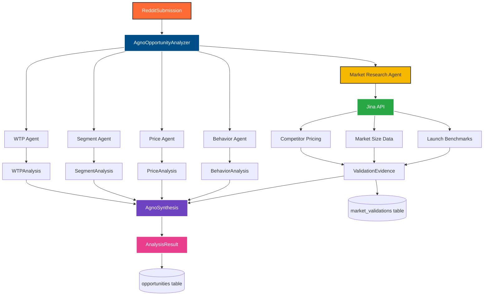
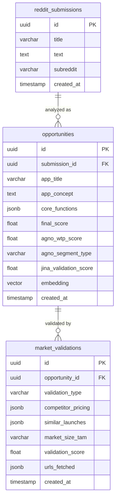

# Data Models Reference

## Overview

Complete reference for all Pydantic models, database schemas, and data structures used in the Agno + Jina integration for Pipeline v3.

**Version**: 1.0
**Last Updated**: 2025-12-03
**Related**: [AGNO_INTEGRATION_ARCHITECTURE.md](../../AGNO_INTEGRATION_ARCHITECTURE.md)

---

## Table of Contents

1. [Core Analysis Models](#core-analysis-models)
2. [Agent-Specific Models](#agent-specific-models)
3. [Jina Market Research Models](#jina-market-research-models)
4. [Database Schema](#database-schema)
5. [Data Flow Diagrams](#data-flow-diagrams)

---

## Core Analysis Models

### AnalysisResult

The primary output model for all analyzers, extended for Agno multi-agent integration.

```python
from pydantic import BaseModel, Field
from typing import Optional, List
from datetime import datetime
from uuid import UUID

class AnalysisResult(BaseModel):
    """
    Complete analysis result from Agno multi-agent pipeline

    Compatible with Pipeline v3 database schema
    """

    # Core identification
    submission_id: UUID = Field(
        description="Reddit submission UUID"
    )

    # App idea analysis
    app_idea: AppIdea = Field(
        description="Generated app idea with core functions"
    )

    # Market metrics
    market_metrics: MarketMetrics = Field(
        description="Market demand, pain, monetization scores"
    )

    # Scoring
    final_score: float = Field(
        ge=0, le=100,
        description="Overall opportunity score (0-100)"
    )

    confidence_score: float = Field(
        ge=0, le=100,
        description="Multi-agent consensus confidence (0-100)"
    )

    trust_level: str = Field(
        description="Trust level: 'high', 'medium', 'low', 'very_low'"
    )

    # LLM reasoning
    llm_reasoning: str = Field(
        description="Multi-agent synthesis reasoning"
    )

    # Vector embedding
    embedding: Optional[List[float]] = Field(
        default=None,
        description="Vector embedding for semantic search (1536 dims)"
    )

    # Agno multi-agent scores (NEW)
    agno_wtp_score: Optional[float] = Field(
        default=None,
        ge=0, le=100,
        description="Willingness to Pay Agent score"
    )

    agno_segment_type: Optional[str] = Field(
        default=None,
        description="Market segment: 'B2B', 'B2C', 'Hybrid'"
    )

    agno_segment_confidence: Optional[float] = Field(
        default=None,
        ge=0, le=100,
        description="Segment classification confidence"
    )

    agno_price_potential: Optional[float] = Field(
        default=None,
        ge=0, le=100,
        description="Price Point Agent revenue potential score"
    )

    agno_behavior_score: Optional[float] = Field(
        default=None,
        ge=0, le=100,
        description="Payment Behavior Agent readiness score"
    )

    agno_consensus_confidence: Optional[float] = Field(
        default=None,
        ge=0, le=100,
        description="Multi-agent consensus confidence"
    )

    # Jina market research (NEW)
    jina_validation_score: Optional[float] = Field(
        default=None,
        ge=0, le=100,
        description="Market validation score from real data"
    )

    jina_data_quality_score: Optional[float] = Field(
        default=None,
        ge=0, le=100,
        description="Data quality and source credibility"
    )

    jina_competitor_count: Optional[int] = Field(
        default=None,
        ge=0,
        description="Number of competitors found"
    )

    jina_market_size_tam: Optional[str] = Field(
        default=None,
        description="Total addressable market size (e.g., '$50B')"
    )

    jina_market_size_growth: Optional[str] = Field(
        default=None,
        description="Market growth rate (e.g., '15% CAGR')"
    )

    jina_evidence_urls: Optional[List[str]] = Field(
        default=None,
        description="Source URLs for market data"
    )

    jina_api_cost_usd: Optional[float] = Field(
        default=None,
        ge=0,
        description="Jina API cost in USD"
    )

    jina_cache_hit_rate: Optional[float] = Field(
        default=None,
        ge=0, le=100,
        description="Jina API cache hit percentage"
    )

    # Metadata
    created_at: datetime = Field(
        default_factory=datetime.utcnow,
        description="Analysis timestamp"
    )

    class Config:
        json_schema_extra = {
            "example": {
                "submission_id": "550e8400-e29b-41d4-a716-446655440000",
                "final_score": 78.5,
                "confidence_score": 82.0,
                "trust_level": "high",
                "agno_wtp_score": 75.0,
                "agno_segment_type": "B2B",
                "agno_price_potential": 82.0,
                "agno_behavior_score": 68.0,
                "jina_validation_score": 85.0,
                "jina_competitor_count": 7
            }
        }
```

### AppIdea

Structured app concept generated from Reddit submission.

```python
class AppIdea(BaseModel):
    """Generated app idea with core functions (max 3)"""

    title: str = Field(
        max_length=200,
        description="App title/name"
    )

    app_concept: str = Field(
        description="Full app concept description"
    )

    problem_statement: str = Field(
        description="Core problem being solved"
    )

    target_audience: str = Field(
        description="Primary target user persona"
    )

    core_functions: List[str] = Field(
        max_length=3,
        description="3 core functions (enforced by SimplicityProcessor)"
    )

    value_proposition: Optional[str] = Field(
        default=None,
        description="Key value delivered to users"
    )
```

### MarketMetrics

Market analysis scores from multi-agent consensus.

```python
class MarketMetrics(BaseModel):
    """Market metrics from multi-agent analysis"""

    market_demand: float = Field(
        ge=0, le=100,
        description="Market demand score (0-100)"
    )

    pain_intensity: float = Field(
        ge=0, le=100,
        description="Pain point intensity score (0-100)"
    )

    monetization_potential: float = Field(
        ge=0, le=100,
        description="Monetization potential score (0-100)"
    )

    # Optional detailed metrics
    audience_size: Optional[str] = Field(
        default=None,
        description="Estimated audience size category"
    )

    competitive_intensity: Optional[str] = Field(
        default=None,
        description="Competitive landscape: 'low', 'medium', 'high'"
    )
```

### AgnoSynthesis

Internal model for multi-agent consensus synthesis.

```python
from typing import Dict, Any

class AgnoSynthesis(BaseModel):
    """
    Multi-agent consensus synthesis

    Internal model used during analysis, converted to AnalysisResult
    """

    market_demand: float = Field(
        ge=0, le=100,
        description="Consensus market demand score"
    )

    pain_intensity: float = Field(
        ge=0, le=100,
        description="Consensus pain intensity score"
    )

    monetization_potential: float = Field(
        ge=0, le=100,
        description="Consensus monetization potential"
    )

    confidence_score: float = Field(
        ge=0, le=100,
        description="Multi-agent consensus confidence"
    )

    agent_details: Dict[str, Any] = Field(
        description="Individual agent outputs for traceability"
    )

    subreddit_multiplier: float = Field(
        ge=0.5, le=3.0,
        default=1.0,
        description="Subreddit-specific purchasing power multiplier"
    )
```

---

## Agent-Specific Models

### WTPAnalysis

Output from WillingnessToPayAgent.

```python
from typing import Literal

class WTPAnalysis(BaseModel):
    """Willingness to Pay Agent output"""

    wtp_score: float = Field(
        ge=0, le=100,
        description="Willingness to pay score (0-100)"
    )

    payment_sentiment: Literal["positive", "neutral", "negative"] = Field(
        description="Overall sentiment toward payment"
    )

    budget_signals: List[str] = Field(
        default_factory=list,
        description="Extracted budget mentions and price references"
    )

    market_demand_score: float = Field(
        ge=0, le=100,
        description="Market demand intensity score (0-100)"
    )

    pain_score: float = Field(
        ge=0, le=100,
        description="Pain point intensity score (0-100)"
    )

    urgency_score: float = Field(
        ge=0, le=100,
        description="User urgency score (0-100)"
    )

    reasoning: str = Field(
        description="Detailed explanation of WTP analysis"
    )
```

### SegmentAnalysis

Output from MarketSegmentAgent.

```python
class SegmentAnalysis(BaseModel):
    """Market Segment Agent output"""

    segment_type: Literal["B2B", "B2C", "Hybrid"] = Field(
        description="Market segment classification"
    )

    target_audience: str = Field(
        description="Primary target user persona"
    )

    audience_size_score: float = Field(
        ge=0, le=100,
        description="Estimated addressable audience size (0-100)"
    )

    industry_vertical: str = Field(
        description="Primary industry or vertical market"
    )

    purchasing_power: Literal["low", "medium", "high", "very_high"] = Field(
        description="Target market purchasing power level"
    )

    purchasing_power_multiplier: float = Field(
        ge=0.5, le=3.0,
        description="Industry-specific revenue multiplier"
    )

    confidence: float = Field(
        ge=0, le=100,
        description="Classification confidence score"
    )

    reasoning: str = Field(
        description="Explanation of segment classification"
    )
```

### PriceAnalysis

Output from PricePointAgent.

```python
class PriceAnalysis(BaseModel):
    """Price Point Agent output"""

    pricing_model: Literal[
        "subscription",
        "freemium",
        "one_time",
        "usage_based",
        "tiered"
    ] = Field(description="Recommended pricing model")

    price_points: Dict[str, float] = Field(
        description="Low/medium/high price scenarios"
    )

    revenue_potential: float = Field(
        ge=0, le=100,
        description="Revenue potential score (0-100)"
    )

    ltv_estimate: float = Field(
        ge=0,
        description="Estimated customer lifetime value (USD)"
    )

    pricing_strategy: str = Field(
        description="Strategic pricing recommendation"
    )

    urgency_score: float = Field(
        ge=0, le=100,
        description="Revenue urgency/opportunity score"
    )

    reasoning: str = Field(
        description="Pricing analysis explanation"
    )
```

### BehaviorAnalysis

Output from PaymentBehaviorAgent.

```python
class BehaviorAnalysis(BaseModel):
    """Payment Behavior Agent output"""

    payment_readiness: float = Field(
        ge=0, le=100,
        description="Purchase readiness score (0-100)"
    )

    friction_score: float = Field(
        ge=0, le=100,
        description="Friction score (0=high friction, 100=low friction)"
    )

    purchase_triggers: List[str] = Field(
        default_factory=list,
        description="Key motivations for purchase"
    )

    friction_points: List[str] = Field(
        default_factory=list,
        description="Identified barriers to purchase"
    )

    decision_timeline: Literal["immediate", "short_term", "long_term"] = Field(
        description="Expected purchase decision timeline"
    )

    optimization_recommendations: List[str] = Field(
        default_factory=list,
        description="Strategies to reduce friction"
    )

    reasoning: str = Field(
        description="Behavioral analysis explanation"
    )
```

---

## Jina Market Research Models

### ValidationEvidence

Complete market validation data from Jina API integration.

```python
from typing import Optional
from dataclasses import dataclass

@dataclass
class ValidationEvidence:
    """Real market data from Jina API"""

    # Competitor analysis
    competitor_pricing: List['CompetitorPricing']

    # Industry reports
    market_size: Optional['MarketSizeData']

    # Launch platforms
    similar_launches: List['ProductLaunchData']

    # Quality metrics
    validation_score: float  # 0-100 (evidence-based)
    data_quality_score: float  # 0-100 (source credibility)
    reasoning: str  # Evidence-backed reasoning

    # Metadata
    search_queries_used: List[str]  # Jina search queries
    urls_fetched: List[str]  # Sources fetched
    total_cost: float  # Jina + LLM costs
```

### CompetitorPricing

Structured competitor pricing data extracted from web sources.

```python
class CompetitorPricing(BaseModel):
    """Competitor pricing data structure"""

    company_name: str = Field(
        description="Competitor company/product name"
    )

    pricing_model: Literal[
        "subscription",
        "freemium",
        "one_time",
        "usage_based",
        "tiered"
    ] = Field(description="Pricing model type")

    pricing_tiers: List['PricingTier'] = Field(
        description="Individual pricing tiers"
    )

    target_market: Literal["SMB", "Enterprise", "Consumer", "Developer"] = Field(
        description="Primary target market"
    )

    source_url: str = Field(
        description="Source URL for pricing data"
    )

    confidence: float = Field(
        ge=0, le=100,
        description="Data extraction confidence"
    )

    extracted_at: datetime = Field(
        default_factory=datetime.utcnow,
        description="Data extraction timestamp"
    )


class PricingTier(BaseModel):
    """Individual pricing tier details"""

    tier_name: str = Field(
        description="Tier name (e.g., 'Free', 'Pro', 'Enterprise')"
    )

    price_monthly: Optional[float] = Field(
        default=None,
        description="Monthly price in USD"
    )

    price_annual: Optional[float] = Field(
        default=None,
        description="Annual price in USD"
    )

    billing_cycle: Optional[str] = Field(
        default=None,
        description="Billing frequency"
    )

    features: List[str] = Field(
        default_factory=list,
        description="Key features included in tier"
    )

    user_limit: Optional[str] = Field(
        default=None,
        description="User/seat limits (e.g., '5 users', 'unlimited')"
    )
```

### MarketSizeData

Market size information from industry reports.

```python
class MarketSizeData(BaseModel):
    """Market size information from industry reports"""

    tam_value: Optional[str] = Field(
        default=None,
        description="Total Addressable Market (e.g., '$50B')"
    )

    sam_value: Optional[str] = Field(
        default=None,
        description="Serviceable Addressable Market"
    )

    som_value: Optional[str] = Field(
        default=None,
        description="Serviceable Obtainable Market"
    )

    growth_rate: Optional[str] = Field(
        default=None,
        description="Market growth rate (e.g., '15% CAGR')"
    )

    market_segment: Optional[str] = Field(
        default=None,
        description="Specific market segment/vertical"
    )

    geographic_scope: Optional[str] = Field(
        default=None,
        description="Geographic coverage (e.g., 'Global', 'North America')"
    )

    source_name: str = Field(
        description="Report source (e.g., 'Statista', 'Grand View Research')"
    )

    source_url: str = Field(
        description="URL of industry report"
    )

    report_date: Optional[str] = Field(
        default=None,
        description="Report publication date"
    )

    confidence: float = Field(
        ge=0, le=100,
        default=70,
        description="Data reliability confidence"
    )
```

### ProductLaunchData

Product launch benchmark data from platforms like Product Hunt.

```python
class ProductLaunchData(BaseModel):
    """Product launch benchmark data"""

    product_name: str = Field(
        description="Product/company name"
    )

    launch_platform: str = Field(
        description="Platform (e.g., 'Product Hunt', 'Hacker News')"
    )

    upvotes: Optional[int] = Field(
        default=None,
        description="Upvotes/points received"
    )

    comments: Optional[int] = Field(
        default=None,
        description="Number of comments"
    )

    category: Optional[str] = Field(
        default=None,
        description="Product category"
    )

    description: Optional[str] = Field(
        default=None,
        description="Product description"
    )

    source_url: str = Field(
        description="Launch page URL"
    )

    launch_date: Optional[str] = Field(
        default=None,
        description="Launch date"
    )

    funding_amount: Optional[str] = Field(
        default=None,
        description="Funding raised (if available)"
    )

    user_count: Optional[str] = Field(
        default=None,
        description="User traction metrics"
    )
```

---

## Database Schema

### opportunities Table (Extended)

PostgreSQL table schema with Agno + Jina extensions.

```sql
CREATE TABLE opportunities (
    -- Core fields (existing)
    id UUID PRIMARY KEY DEFAULT gen_random_uuid(),
    submission_id UUID NOT NULL REFERENCES reddit_submissions(id),
    app_title VARCHAR(200) NOT NULL,
    app_concept TEXT NOT NULL,
    problem_statement TEXT,
    target_audience TEXT,
    core_functions JSONB NOT NULL,  -- Array of max 3 functions
    value_proposition TEXT,

    -- Market metrics (existing)
    market_demand FLOAT CHECK (market_demand BETWEEN 0 AND 100),
    pain_intensity FLOAT CHECK (pain_intensity BETWEEN 0 AND 100),
    monetization_potential FLOAT CHECK (monetization_potential BETWEEN 0 AND 100),
    audience_size VARCHAR(50),
    competitive_intensity VARCHAR(20),

    -- Scoring (existing)
    final_score FLOAT NOT NULL CHECK (final_score BETWEEN 0 AND 100),
    confidence_score FLOAT CHECK (confidence_score BETWEEN 0 AND 100),
    trust_level VARCHAR(20),
    llm_reasoning TEXT,

    -- Vector embedding (existing)
    embedding vector(1536),  -- pgvector extension

    -- Agno multi-agent scores (NEW)
    agno_wtp_score FLOAT CHECK (agno_wtp_score BETWEEN 0 AND 100),
    agno_segment_type VARCHAR(10),  -- 'B2B', 'B2C', 'Hybrid'
    agno_segment_confidence FLOAT CHECK (agno_segment_confidence BETWEEN 0 AND 100),
    agno_price_potential FLOAT CHECK (agno_price_potential BETWEEN 0 AND 100),
    agno_behavior_score FLOAT CHECK (agno_behavior_score BETWEEN 0 AND 100),
    agno_consensus_confidence FLOAT CHECK (agno_consensus_confidence BETWEEN 0 AND 100),

    -- Jina market research (NEW)
    jina_validation_score FLOAT CHECK (jina_validation_score BETWEEN 0 AND 100),
    jina_data_quality_score FLOAT CHECK (jina_data_quality_score BETWEEN 0 AND 100),
    jina_competitor_count INT CHECK (jina_competitor_count >= 0),
    jina_market_size_tam VARCHAR(50),
    jina_market_size_growth VARCHAR(20),
    jina_evidence_urls JSONB,  -- Array of source URLs
    jina_api_cost_usd NUMERIC(10,6) CHECK (jina_api_cost_usd >= 0),
    jina_cache_hit_rate FLOAT CHECK (jina_cache_hit_rate BETWEEN 0 AND 100),

    -- Metadata (existing)
    created_at TIMESTAMP WITH TIME ZONE DEFAULT NOW(),
    updated_at TIMESTAMP WITH TIME ZONE DEFAULT NOW()
);

-- Indexes
CREATE INDEX idx_opportunities_final_score ON opportunities(final_score DESC);
CREATE INDEX idx_opportunities_confidence ON opportunities(confidence_score DESC);
CREATE INDEX idx_opportunities_segment ON opportunities(agno_segment_type);
CREATE INDEX idx_opportunities_jina_validation ON opportunities(jina_validation_score DESC);
CREATE INDEX idx_opportunities_embedding ON opportunities USING ivfflat (embedding vector_cosine_ops);
```

### market_validations Table

Separate table for detailed Jina market research data.

```sql
CREATE TABLE market_validations (
    -- Primary key
    id UUID PRIMARY KEY DEFAULT gen_random_uuid(),
    opportunity_id UUID NOT NULL REFERENCES opportunities(id) ON DELETE CASCADE,

    -- Validation metadata
    validation_type VARCHAR(50) NOT NULL,  -- 'jina_competitor', 'jina_market_size', etc.
    validation_source VARCHAR(100),  -- 'Jina Reader API', 'Statista', etc.
    validation_score FLOAT CHECK (validation_score BETWEEN 0 AND 100),
    data_quality_score FLOAT CHECK (data_quality_score BETWEEN 0 AND 100),
    reasoning TEXT,

    -- Competitor analysis
    competitor_pricing JSONB,  -- Array of CompetitorPricing objects
    competitors_found INT DEFAULT 0,

    -- Market size data
    market_size_tam VARCHAR(50),
    market_size_sam VARCHAR(50),
    market_size_growth VARCHAR(20),
    market_source VARCHAR(200),

    -- Product launches
    similar_launches JSONB,  -- Array of ProductLaunchData objects
    launches_analyzed INT DEFAULT 0,

    -- Evidence metadata
    search_queries_used JSONB,  -- Array of search queries
    urls_fetched JSONB,  -- Array of URLs
    extraction_stats JSONB,  -- Extraction metrics
    jina_api_calls_count INT DEFAULT 0,
    jina_cache_hit_rate FLOAT CHECK (jina_cache_hit_rate BETWEEN 0 AND 100),
    total_cost_usd NUMERIC(10,6) CHECK (total_cost_usd >= 0),

    -- Timestamps
    created_at TIMESTAMP WITH TIME ZONE DEFAULT NOW(),
    updated_at TIMESTAMP WITH TIME ZONE DEFAULT NOW()
);

-- Indexes
CREATE INDEX idx_market_validations_opportunity ON market_validations(opportunity_id);
CREATE INDEX idx_market_validations_score ON market_validations(validation_score DESC);
CREATE INDEX idx_market_validations_type ON market_validations(validation_type);
```

### Database Migration Script

```sql
-- Migration: Add Agno + Jina columns to opportunities table
-- Version: 1.0
-- Date: 2025-12-03

BEGIN;

-- Phase 1: Add Agno multi-agent columns
ALTER TABLE opportunities ADD COLUMN IF NOT EXISTS agno_wtp_score FLOAT CHECK (agno_wtp_score BETWEEN 0 AND 100);
ALTER TABLE opportunities ADD COLUMN IF NOT EXISTS agno_segment_type VARCHAR(10);
ALTER TABLE opportunities ADD COLUMN IF NOT EXISTS agno_segment_confidence FLOAT CHECK (agno_segment_confidence BETWEEN 0 AND 100);
ALTER TABLE opportunities ADD COLUMN IF NOT EXISTS agno_price_potential FLOAT CHECK (agno_price_potential BETWEEN 0 AND 100);
ALTER TABLE opportunities ADD COLUMN IF NOT EXISTS agno_behavior_score FLOAT CHECK (agno_behavior_score BETWEEN 0 AND 100);
ALTER TABLE opportunities ADD COLUMN IF NOT EXISTS agno_consensus_confidence FLOAT CHECK (agno_consensus_confidence BETWEEN 0 AND 100);

-- Phase 2: Add Jina market research columns
ALTER TABLE opportunities ADD COLUMN IF NOT EXISTS jina_validation_score FLOAT CHECK (jina_validation_score BETWEEN 0 AND 100);
ALTER TABLE opportunities ADD COLUMN IF NOT EXISTS jina_data_quality_score FLOAT CHECK (jina_data_quality_score BETWEEN 0 AND 100);
ALTER TABLE opportunities ADD COLUMN IF NOT EXISTS jina_competitor_count INT CHECK (jina_competitor_count >= 0);
ALTER TABLE opportunities ADD COLUMN IF NOT EXISTS jina_market_size_tam VARCHAR(50);
ALTER TABLE opportunities ADD COLUMN IF NOT EXISTS jina_market_size_growth VARCHAR(20);
ALTER TABLE opportunities ADD COLUMN IF NOT EXISTS jina_evidence_urls JSONB;
ALTER TABLE opportunities ADD COLUMN IF NOT EXISTS jina_api_cost_usd NUMERIC(10,6) CHECK (jina_api_cost_usd >= 0);
ALTER TABLE opportunities ADD COLUMN IF NOT EXISTS jina_cache_hit_rate FLOAT CHECK (jina_cache_hit_rate BETWEEN 0 AND 100);

-- Create indexes for new columns
CREATE INDEX IF NOT EXISTS idx_opportunities_segment ON opportunities(agno_segment_type);
CREATE INDEX IF NOT EXISTS idx_opportunities_jina_validation ON opportunities(jina_validation_score DESC);

-- Add comments
COMMENT ON COLUMN opportunities.agno_wtp_score IS 'Willingness to Pay Agent score (0-100)';
COMMENT ON COLUMN opportunities.agno_segment_type IS 'Market segment: B2B, B2C, or Hybrid';
COMMENT ON COLUMN opportunities.jina_validation_score IS 'Market validation score from real web data';
COMMENT ON COLUMN opportunities.jina_competitor_count IS 'Number of competitors found via Jina API';

COMMIT;
```

---

## Data Flow Diagrams

### End-to-End Analysis Flow



### Database Entity Relationships



### Jina API Data Flow

```mermaid
sequenceDiagram
    participant A as AgnoAnalyzer
    participant M as MarketResearchAgent
    participant J as Jina API
    participant L as LLM Extractor
    participant DB as Database

    A->>M: Request market validation
    M->>J: search_web("competitor pricing")
    J-->>M: List[URL]

    loop For each competitor
        M->>J: read_url(pricing_page)
        J-->>M: Markdown content
        M->>L: Extract pricing data
        L-->>M: CompetitorPricing
    end

    M->>J: search_web("market size")
    J-->>M: Report URLs
    M->>J: read_url(report)
    J-->>M: Market size content
    M->>L: Extract market data
    L-->>M: MarketSizeData

    M-->>A: ValidationEvidence
    A->>DB: Store AnalysisResult
    A->>DB: Store market_validations

    style M fill:#F7B801,stroke:#333,stroke-width:2px
    style J fill:#28a745,stroke:#fff,stroke-width:2px
```

---

## Model Relationships

### Class Hierarchy

```
BaseModel (Pydantic)
├── AnalysisResult
│   ├── AppIdea
│   ├── MarketMetrics
│   └── embedding: List[float]
│
├── AgnoSynthesis
│   └── agent_details: Dict[str, AgentAnalysis]
│
├── Agent Outputs
│   ├── WTPAnalysis
│   ├── SegmentAnalysis
│   ├── PriceAnalysis
│   └── BehaviorAnalysis
│
└── Jina Models
    ├── ValidationEvidence
    │   ├── CompetitorPricing[]
    │   │   └── PricingTier[]
    │   ├── MarketSizeData
    │   └── ProductLaunchData[]
    └── MarketResearchAnalysis
```

---

## Usage Examples

### Creating an AnalysisResult

```python
from pipeline_v3.transform.models import AnalysisResult, AppIdea, MarketMetrics

analysis = AnalysisResult(
    submission_id=submission.id,
    app_idea=AppIdea(
        title="Smart Invoice Automation",
        app_concept="Automated invoicing for small businesses",
        problem_statement="Manual invoice creation wastes 10+ hours/week",
        target_audience="Small business owners",
        core_functions=[
            "Auto-generate invoices from time tracking",
            "Email invoices to clients",
            "Track payment status"
        ]
    ),
    market_metrics=MarketMetrics(
        market_demand=78.5,
        pain_intensity=82.0,
        monetization_potential=75.0
    ),
    final_score=78.5,
    confidence_score=82.0,
    trust_level="high",
    agno_wtp_score=75.0,
    agno_segment_type="B2B",
    agno_segment_confidence=90.0,
    agno_price_potential=82.0,
    agno_behavior_score=68.0,
    jina_validation_score=85.0,
    jina_competitor_count=7,
    jina_market_size_tam="$12B",
    jina_market_size_growth="18% CAGR",
    jina_evidence_urls=[
        "https://competitor1.com/pricing",
        "https://statista.com/market-report"
    ],
    llm_reasoning="High B2B potential with validated market demand..."
)
```

### Storing ValidationEvidence

```python
from agent_tools.market_data_validator import ValidationEvidence, CompetitorPricing

evidence = ValidationEvidence(
    competitor_pricing=[
        CompetitorPricing(
            company_name="CompetitorA",
            pricing_model="subscription",
            pricing_tiers=[
                PricingTier(
                    tier_name="Pro",
                    price_monthly=29.99,
                    features=["Unlimited invoices", "Email support"]
                )
            ],
            target_market="SMB",
            source_url="https://competitora.com/pricing",
            confidence=95.0
        )
    ],
    market_size=MarketSizeData(
        tam_value="$12B",
        growth_rate="18% CAGR",
        source_name="Statista",
        source_url="https://statista.com/report/123"
    ),
    similar_launches=[],
    validation_score=85.0,
    data_quality_score=90.0,
    reasoning="Strong competitive validation with 7 competitors found",
    search_queries_used=["invoice automation pricing", "SMB invoice tools"],
    urls_fetched=["https://competitora.com/pricing"],
    total_cost=0.0075
)
```

---

## References

- **Architecture**: [AGNO_INTEGRATION_ARCHITECTURE.md](../../AGNO_INTEGRATION_ARCHITECTURE.md)
- **Agent Specs**: [agent-specifications.md](./agent-specifications.md)
- **API Compatibility**: [api-compatibility.md](./api-compatibility.md)
- **Pydantic Documentation**: https://docs.pydantic.dev/
- **PostgreSQL pgvector**: https://github.com/pgvector/pgvector

---

**Document Version**: 1.0
**Author**: RedditHarbor Engineering Team
**Status**: Reference Documentation
