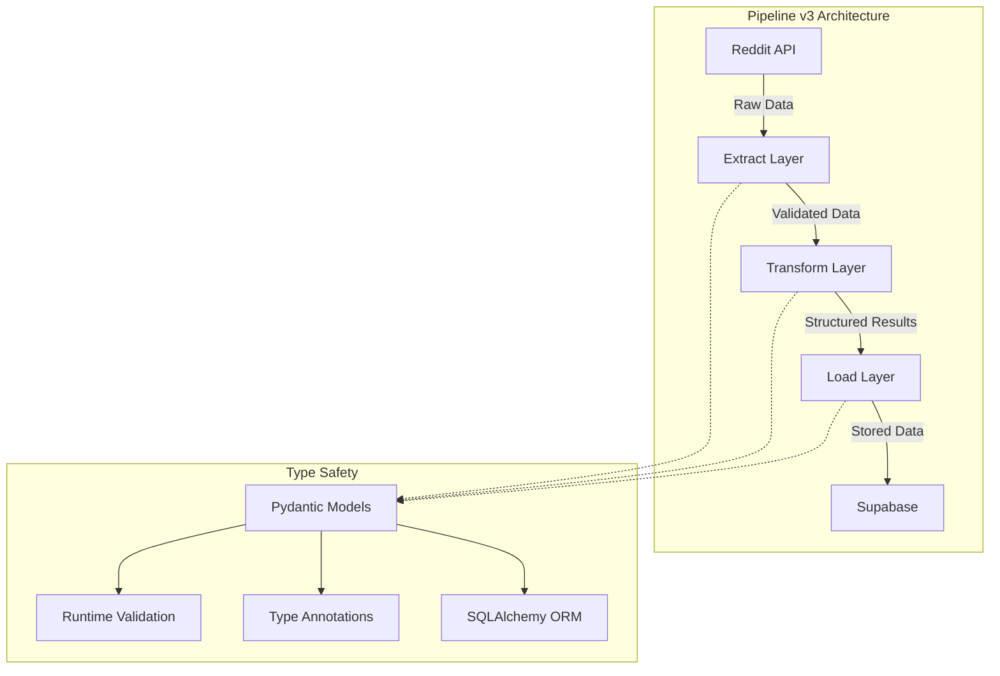
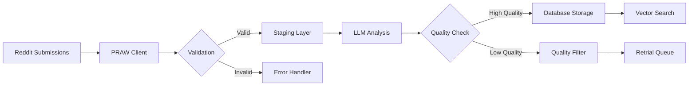
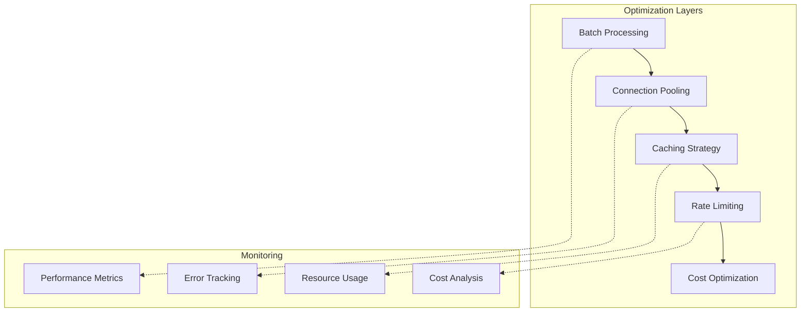
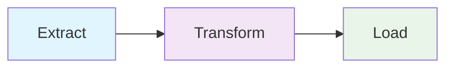

# Pipeline v3 Visual Documentation Assets

<div align="center">

**Architecture Diagrams and Visual Resources**

*Comprehensive visual documentation for Pipeline v3 architecture and workflows*

</div>

## 📋 Available Assets

### Architecture Diagrams

- [`pipeline-architecture.md`](./pipeline-architecture.md) - Overall system architecture
- [`data-flow.md`](./data-flow.md) - Data flow through ELT pipeline
- [`component-interaction.md`](./component-interaction.md) - Component interaction diagrams
- [`deployment-architecture.md`](./deployment-architecture.md) - Production deployment architecture

### Workflow Diagrams

- [`elt-workflow.md`](./elt-workflow.md) - ELT workflow visualization
- [`reddit-extraction.md`](./reddit-extraction.md) - Reddit API extraction workflow
- [`llm-processing.md`](./llm-processing.md) - LLM analysis processing flow
- [`database-storage.md`](./database-storage.md) - Database storage and retrieval workflow

### Technical Diagrams

- [`type-system.md`](./type-system.md) - Pydantic type system architecture
- [`error-handling.md`](./error-handling.md) - Error handling and resilience patterns
- [`performance-optimization.md`](./performance-optimization.md) - Performance optimization strategies
- [`monitoring-metrics.md`](./monitoring-metrics.md) - Monitoring and metrics architecture

### Integration Diagrams

- [`api-integrations.md`](./api-integrations.md) - External API integrations
- [`authentication-flow.md`](./authentication-flow.md) - Authentication and security flows
- [`circuit-breaker.md`](./circuit-breaker.md) - Circuit breaker patterns
- [`rate-limiting.md`](./rate-limiting.md) - Rate limiting strategies

## 🖼️ Diagram Categories

### 📐 Architecture Overview



### 🔄 Data Flow Patterns



### ⚡ Performance Optimization



## 📁 Asset Structure

```
assets/
├── README.md           # This file - asset index
├── images/            # Screenshots and examples
├── diagrams/          # Architecture diagrams
├── logos/             # Project logos and branding
└── examples/          # Code examples and outputs
```

## 🖼️ Images

### Screenshots
- Pipeline execution examples
- Database schema visualizations
- API interface screenshots
- Configuration examples

### Usage Examples
```
# Include images in documentation like this:

```

## 📊 Diagrams

### Current Diagrams
- ELT Architecture Flow (Mermaid - embedded in docs)
- Database Schema (SQL + visual representation)
- API Integration Map

### Diagram Formats
- **Mermaid**: Text-based diagrams for documentation
- **PNG**: High-quality raster images
- **SVG**: Scalable vector graphics
- **Draw.io**: Editable diagram files

### Creating New Diagrams


## 🎨 Visual Style Guide

### Color Scheme
- **Primary**: #FF6B35 (CueTimer Orange)
- **Secondary**: #004E89 (Deep Blue)
- **Accent**: #F7B801 (Yellow)
- **Success**: #3ECF8E (Green)
- **Warning**: #FFA500 (Orange)
- **Error**: #FF4757 (Red)

### Typography
- **Headings**: Clean, bold sans-serif
- **Body**: Readable sans-serif
- **Code**: Monospace for code examples

### Diagram Standards
- Consistent color coding
- Clear labels and annotations
- Logical flow direction
- Professional appearance

## 📚 Asset Usage

### In Markdown Documentation
```markdown
# Relative path from docs/


# With sizing
{width=800}

# With caption

*Figure: Pipeline v3 database schema*
```

### In HTML Documentation
```html

```

## 🔧 Asset Management

### Adding New Assets
1. Place in appropriate subdirectory
2. Use descriptive naming (kebab-case)
3. Optimize file size for web
4. Update this README

### File Naming Conventions
- **Images**: `descriptive-name.png`
- **Diagrams**: `component-diagram.svg`
- **Screenshots**: `feature-screenshot-2025-12-01.png`
- **Logos**: `logo-light.png`, `logo-dark.png`

### Optimization Guidelines
- **PNG**: For screenshots and diagrams with text
- **JPEG**: For photographs
- **SVG**: For scalable diagrams and icons
- **WebP**: For web-optimized images

## 📋 Asset Index

### Current Assets
*(This section will be updated as assets are added)*

#### Diagrams
- `elt-architecture-overview.png` - Main pipeline architecture
- `database-schema.png` - Database structure
- `api-integration-map.png` - External API connections

#### Images
- `pipeline-execution.png` - Running pipeline example
- `supabase-setup.png` - Database configuration
- `reddit-api-setup.png` - API configuration

#### Examples
- `opportunity-output.json` - Sample pipeline output
- `configuration-example.env` - Configuration example
- `error-log-example.txt` - Log file example

## 🎯 Planned Assets

### High Priority
- [ ] Complete ELT architecture diagram
- [ ] Database schema visualization
- [ ] API integration flowchart
- [ ] Error handling flowchart

### Medium Priority
- [ ] Performance comparison charts
- [ ] Quality scoring visualization
- [ ] Deployment architecture diagram
- [ ] Security model diagram

### Low Priority
- [ ] Brand style guide
- [ ] Marketing materials
- [ ] Video tutorials
- [ ] Interactive demos

## 🛠️ Asset Tools

### Recommended Tools
- **Diagrams**: Mermaid, Draw.io, Lucidchart
- **Screenshots**: Snagit, Lightshot, built-in tools
- **Image Editing**: GIMP, Figma, Canva
- **Optimization**: ImageOptim, TinyPNG

### Workflow
1. **Create**: Use appropriate tool for asset type
2. **Review**: Ensure quality and consistency
3. **Optimize**: Compress for web delivery
4. **Document**: Update README and add alt text
5. **Commit**: Include in version control

---

## 📞 Asset Contributions

### Contributing Guidelines
- Follow naming conventions
- Optimize file sizes
- Include descriptive alt text
- Update this README
- Test in documentation

### Asset Review Process
1. Visual quality check
2. File size optimization
3. Accessibility compliance
4. Documentation accuracy
5. Brand consistency

---

<div align="center">

**📁 Asset Collection Growing...**

**Contribute visual assets to improve documentation quality.**

</div>