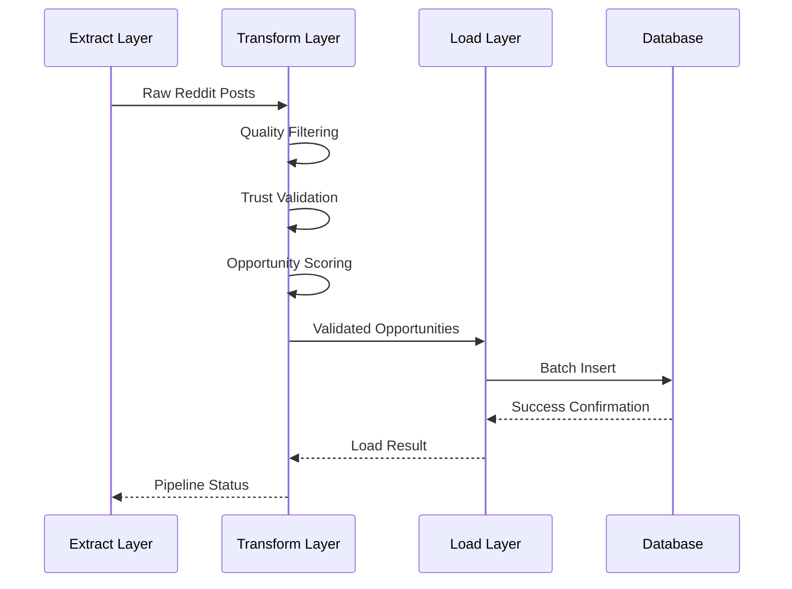

# Pipeline v3 Component Documentation

<div align="center">

**ELT Pipeline Components and Systems**

*Understanding the building blocks of clean Reddit data processing*

</div>

## 📋 Table of Contents

- [🏗️ ELT Pipeline Architecture](#️-elt-pipeline-architecture)
- [🔍 Extract Layer](#-extract-layer)
- [⚡ Transform Layer](#-transform-layer)
- [💾 Load Layer](#-load-layer)
- [🔧 Core Systems](#-core-systems)

---

## 🏗️ ELT Pipeline Architecture

### Overview
Pipeline v3 follows a clean **Extract → Transform → Load** (ELT) pattern with type safety and comprehensive error handling.

### Architecture Flow
```
┌─────────────┐    ┌─────────────┐    ┌─────────────┐
│   EXTRACT   │ →  │  TRANSFORM  │ →  │    LOAD     │
│             │    │             │    │             │
│ • Reddit    │    │ • Quality   │    │ • Database  │
│   API       │    │   Filtering │    │   Storage   │
│ • LLM       │    │ • Trust     │    │ • Transactions│
│   Analysis  │    │   Validation│    │ • Batch     │
│ • Raw Data  │    │ • Scoring   │    │   Processing│
└─────────────┘    └─────────────┘    └─────────────┘
```

### Key Design Principles
- **Type Safety**: All data uses Pydantic models
- **Error Resilience**: Comprehensive error handling at each layer
- **Performance**: Async I/O and batch processing
- **Testability**: Each component independently testable
- **Scalability**: Designed for high-volume data processing

---

## 🔍 Extract Layer

### Purpose
The Extract layer retrieves raw data from external APIs and prepares it for processing.

### Components

#### Reddit Client (`extract/reddit_client.py`)
**Responsibility**: Extract Reddit posts and comments with rate limiting

**Key Features**:
- Rate limiting and backoff
- Error handling and retries
- Data structure normalization
- Async data streaming

**Example Usage**:
```python
from pipeline_v3.extract.reddit_client import RedditExtractor

extractor = RedditExtractor(
    client_id=REDDIT_CLIENT_ID,
    client_secret=REDDIT_CLIENT_SECRET,
    user_agent="RedditHarbor/1.0"
)

async for post in extractor.extract_posts("productivity", limit=100):
    # Process each post
    print(f"Extracted: {post.title}")
```

**Configuration**:
```python
# Rate limiting settings
REDDIT_RATE_LIMIT = {
    "requests_per_minute": 60,
    "burst_requests": 300,
    "backoff_factor": 2,
    "max_retries": 3
}
```

#### LLM Client (`extract/llm_client.py`)
**Responsibility**: Analyze content using language models for opportunity detection

**Key Features**:
- Multiple model support (OpenRouter)
- Structured output validation
- Cost optimization
- Error handling and fallbacks

**Example Usage**:
```python
from pipeline_v3.extract.llm_client import LLMAnalyzer

analyzer = LLMAnalyzer(
    api_key=OPENROUTER_API_KEY,
    model="anthropic/claude-3.5-sonnet"
)

result = await analyzer.analyze_content(
    content="I wish there was a better way to track my productivity",
    analysis_type="opportunity_detection"
)
```

### Data Models
The extract layer produces standardized data structures:
```python
# Raw Reddit data
RedditPost(
    id="t3_123456",
    title="How do I track productivity?",
    author="productivity_user",
    subreddit="productivity",
    score=500,
    num_comments=50,
    content="I've been struggling with...",
    created_at=datetime.now()
)

# LLM analysis results
LLMAnalysisResult(
    analysis_type="opportunity_detection",
    structured_data={
        "opportunity_type": "web_app",
        "pain_point": "productivity tracking",
        "confidence_score": 0.85
    }
)
```

---

## ⚡ Transform Layer

### Purpose
The Transform layer processes raw data, applies business logic, and validates quality and trustworthiness.

### Components

#### Quality Filter (`transform/quality_filter.py`)
**Responsibility**: Assess content quality and filter low-quality posts

**Quality Metrics**:
- **Engagement** (30%): Score and comment count
- **Content Quality** (25%): Length and title quality
- **Recency** (20%): Time-based scoring
- **Author Reputation** (15%): User credibility
- **Discussion Quality** (10%): Comment thread quality

**Example Usage**:
```python
from pipeline_v3.transform.quality_filter import QualityFilter

filter = QualityFilter(min_score_threshold=0.7)
filtered_posts, quality_scores = filter.filter_posts(raw_posts)

print(f"Passed quality: {len(filtered_posts)}/{len(raw_posts)}")
```

**Quality Scoring Example**:
```python
# High-quality post might score:
{
    "engagement": 0.8,      # Good upvotes and comments
    "content_quality": 0.9, # Good length and title
    "recency": 0.7,         # Recent post
    "author_reputation": 0.8, # Established user
    "discussion_quality": 0.6, # Decent discussion
    "overall_score": 0.77   # Weighted average
}
```

#### Trust Validator (`transform/trust_validation.py`)
**Responsibility**: Assess content trustworthiness and credibility

**Trust Factors**:
- **Author History** (30%): Account age and activity
- **Content Consistency** (25%): Internal logic check
- **Sentiment Analysis** (20%): Genuine vs. spam indicators
- **Source Credibility** (15%): Subreddit reputation
- **Temporal Consistency** (10%): Timeline validation

**Example Usage**:
```python
from pipeline_v3.transform.trust_validation import TrustValidator

validator = TrustValidator()
trust_score = validator.validate_content(post, comments)

print(f"Trust level: {trust_score.trust_level}")
# Output: "HIGH", "MEDIUM", "LOW", "VERY_LOW"
```

#### Opportunity Scorer (`transform/opportunity_scorer.py`)
**Responsibility**: Combine quality, trust, and LLM analysis to score business opportunities

**Scoring Components**:
- **Quality Score** (40%): Content quality metrics
- **Trust Score** (30%): Content trustworthiness
- **LLM Analysis** (20%): AI-powered opportunity detection
- **Market Indicators** (10%): Demand signals

**Example Usage**:
```python
from pipeline_v3.transform.opportunity_scorer import OpportunityScorer

scorer = OpportunityScorer()
opportunity_score = scorer.score_opportunity(
    post=post,
    trust_score=trust_score,
    llm_analysis=llm_result
)

print(f"Opportunity score: {opportunity_score.overall_score}/100")
```

### Data Flow
```
Raw Data → Quality Filter → Trust Validator → Opportunity Scorer → Validated Opportunities
```

---

## 💾 Load Layer

### Purpose
The Load layer stores processed data in the database with transaction safety and performance optimization.

### Components

#### Repository Pattern (`load/repositories.py`)
**Responsibility**: Database operations with clean interface and error handling

**Key Features**:
- Async database operations
- Transaction safety
- Batch processing
- Error handling and rollback
- Query optimization

**Example Usage**:
```python
from pipeline_v3.load.repositories import OpportunityRepository

repo = OpportunityRepository(db_session)

# Create single opportunity
opportunity = await repo.create_opportunity(app_opportunity)

# Bulk create opportunities
result = await repo.bulk_create_opportunities(opportunities_list)

# Query high-scoring opportunities
high_score = await repo.find_opportunities_by_score(min_score=80.0)
```

#### Transaction Manager (`load/transaction_manager.py`)
**Responsibility**: Manage database transactions with proper error handling

**Key Features**:
- Context manager for transactions
- Automatic rollback on errors
- Read-only session support
- Connection pooling management

**Example Usage**:
```python
from pipeline_v3.load.transaction_manager import TransactionManager

tx_manager = TransactionManager(session_factory)

# Use context manager
async with tx_manager.get_transaction() as session:
    repo = OpportunityRepository(session)
    result = await repo.bulk_create_opportunities(data)
    # Automatic commit or rollback

# Execute operation in transaction
result = await tx_manager.execute_in_transaction(
    create_opportunities,
    opportunities_data
)
```

### Database Schema
```sql
-- Main opportunities table
CREATE TABLE app_opportunities (
    id SERIAL PRIMARY KEY,
    reddit_post_id VARCHAR(20) NOT NULL,
    title TEXT NOT NULL,
    content TEXT,
    author VARCHAR(100),
    subreddit VARCHAR(50),
    opportunity_score DECIMAL(5,2),
    trust_score DECIMAL(5,2),
    quality_score DECIMAL(5,2),
    opportunity_type VARCHAR(50),
    pain_points TEXT,
    solution_complexity VARCHAR(20),
    market_demand VARCHAR(20),
    monetization_potential VARCHAR(20),
    confidence_score DECIMAL(3,2),
    llm_analysis JSONB,
    score_components JSONB,
    created_at TIMESTAMP DEFAULT NOW(),
    updated_at TIMESTAMP DEFAULT NOW()
);

-- Indexes for performance
CREATE INDEX idx_opportunities_score ON app_opportunities(opportunity_score DESC);
CREATE INDEX idx_opportunities_subreddit ON app_opportunities(subreddit);
CREATE INDEX idx_opportunities_created ON app_opportunities(created_at DESC);
```

---

## 🔧 Core Systems

### Configuration Management
**Location**: `config/settings.py`

**Features**:
- Environment-based configuration
- Type-safe settings with Pydantic
- Validation and defaults
- Secret management

**Example Configuration**:
```python
from pipeline_v3.config import get_config

config = get_config()

# Access configuration
print(f"Batch size: {config.batch_size}")
print(f"Log level: {config.log_level}")
print(f"Database URL: {config.database_url}")
```

### Error Handling System
**Features**:
- Structured error types
- Comprehensive logging
- Error recovery mechanisms
- User-friendly error messages

**Error Types**:
```python
# API errors
RedditAPIError
LLMAPIError
DatabaseError

# Validation errors
ValidationError
QualityThresholdError
TrustThresholdError

# Pipeline errors
PipelineError
ExtractionError
TransformationError
LoadError
```

### Logging System
**Features**:
- Structured logging with correlation IDs
- Multiple log levels and destinations
- Performance metrics
- Error tracking and alerting

**Log Levels**:
```python
DEBUG    # Detailed debugging information
INFO     # General information messages
WARNING  # Warning messages for potential issues
ERROR    # Error messages for failures
CRITICAL # Critical errors requiring immediate attention
```

### Monitoring and Metrics
**Features**:
- Pipeline performance metrics
- API usage tracking
- Error rate monitoring
- Resource utilization

**Key Metrics**:
```python
# Performance metrics
pipeline_duration_seconds
posts_extracted_total
opportunities_created_total
batch_processing_duration

# Error metrics
error_rate_by_type
api_failure_rate
validation_failure_rate
```

---

## 🧪 Testing Components

### Unit Testing
Each component includes comprehensive unit tests:

```python
# Example component test
class TestQualityFilter:
    def test_high_quality_post_passes_filter(self):
        filter = QualityFilter(min_score_threshold=0.7)
        post = create_high_quality_post()

        filtered_posts, scores = filter.filter_posts([post])

        assert len(filtered_posts) == 1
        assert scores[0].overall_score >= 0.7
```

### Integration Testing
Components are tested together:

```python
# Example integration test
class TestExtractionToLoading:
    @pytest.mark.asyncio
    async def test_full_pipeline_flow(self):
        # Test extract → transform → load flow
        extractor = RedditExtractor(...)
        transformer = QualityFilter(...)
        loader = OpportunityRepository(...)

        # Execute pipeline
        raw_posts = await extractor.extract_posts("test", limit=10)
        filtered_posts, scores = transformer.filter_posts(raw_posts)
        result = await loader.bulk_create_opportunities(filtered_posts)

        assert result["success"] is True
        assert result["created_count"] > 0
```

---

## 📊 Performance Characteristics

### Throughput Metrics
- **Reddit Extraction**: ~60 posts/minute (rate limited)
- **LLM Analysis**: ~100 requests/minute
- **Database Writes**: ~1000 records/second (batched)
- **Full Pipeline**: ~50 posts/minute end-to-end

### Memory Usage
- **Base Pipeline**: ~200MB
- **Batch Processing**: Additional ~50MB per 100 posts
- **LLM Processing**: Additional ~100MB for large models

### Optimization Strategies
- Async I/O for all external calls
- Batch database operations
- Connection pooling
- Memory-efficient streaming
- Rate limiting and backoff

---

## 🔄 Component Interactions

### Data Flow Diagram


### Error Propagation
```
Reddit API Error → Extract Layer → Pipeline Error → User Notification
LLM API Error → Extract Layer → Pipeline Error → Fallback to Mock
Database Error → Load Layer → Transaction Rollback → Retry Logic
ValidationError → Transform Layer → Filter Out → Continue Processing
```

---

## 🛠️ Component Development

### Adding New Components
1. **Define Interface**: Clear input/output contracts
2. **Implement Type Safety**: Use Pydantic models
3. **Add Error Handling**: Comprehensive error management
4. **Write Tests**: Unit and integration tests
5. **Add Logging**: Structured logging with correlation
6. **Document**: Clear documentation and examples

### Component Standards
- **Async First**: All I/O operations must be async
- **Type Safety**: Use type hints and Pydantic validation
- **Error Resilience**: Handle failures gracefully
- **Testability**: Design for easy testing
- **Performance**: Consider scalability and efficiency
- **Monitoring**: Include metrics and logging

---

<div align="center">

**🧩 Component Documentation Complete!**

**For detailed implementation, see the [Implementation Guide](../implementation/elt-pipeline-implementation.md)**

</div>