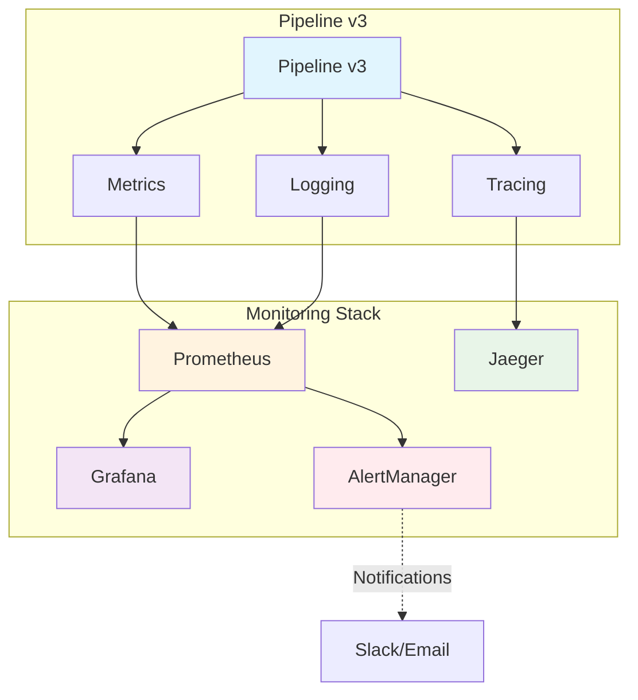

# Pipeline v3 Monitoring Setup

Complete monitoring and observability setup for Pipeline v3 with Prometheus, Grafana, Jaeger, and AlertManager.

## Architecture Overview



## Components

### 1. Metrics Collection (`utils/metrics.py`)

**PipelineMetrics Class:**
- Pipeline execution metrics (duration, success rate)
- Stage-specific metrics (extract, transform, load)
- Reddit API metrics (requests, response time, success rate)
- LLM processing metrics (requests, tokens, duration)
- Database metrics (operations, response time)
- Quality metrics (validation rate, deduplication rate)

**Usage:**
```python
from utils.metrics import get_metrics

metrics = get_metrics()

# Record pipeline completion
metrics.record_pipeline_completion(
    start_time=start_time,
    subreddits=['productivity', 'tools'],
    sort_by='hot',
    success=True
)

# Record Reddit API call
metrics.record_reddit_api_request(
    endpoint='fetch_submissions',
    subreddit='productivity',
    duration=2.5,
    status='success'
)
```

### 2. Structured Logging (`utils/structured_logging.py`)

**Features:**
- JSON-structured log format
- Correlation IDs for request tracing
- Thread-safe context management
- Automatic log enrichment
- Event-based logging

**Usage:**
```python
from utils.structured_logging import get_structured_logger, pipeline_context, stage_context

logger = get_structured_logger(__name__)

# With pipeline context
with pipeline_context(run_id="pipeline-123"):
    logger.pipeline_start({"subreddits": ["productivity"], "limit": 10})

    # With stage context
    with stage_context("extract", {"subreddit": "productivity"}):
        logger.reddit_api_call(
            endpoint="fetch_submissions",
            subreddit="productivity",
            duration=2.5,
            status="success"
        )
```

### 3. Distributed Tracing (`utils/tracing.py`)

**Features:**
- OpenTelemetry-based tracing
- Jaeger/OTLP export support
- Automatic span management
- Context propagation
- Error tracking

**Usage:**
```python
from utils.tracing import trace_pipeline_execution, trace_stage, get_tracer

# Initialize tracing
tracer = get_tracer().initialize_tracing(
    service_name="pipeline-v3",
    jaeger_endpoint="http://localhost:14268/api/traces"
)

# Trace pipeline execution
with trace_pipeline_execution(
    pipeline_id="pipeline-123",
    subreddits=["productivity"],
    limit=10
) as span:
    # Trace stages
    with trace_stage("extract", "pipeline-123"):
        # Reddit extraction logic
        pass
```

## Installation & Setup

### Prerequisites

```bash
# Install monitoring dependencies using uv
uv add prometheus-client opentelemetry-api opentelemetry-sdk \
       opentelemetry-exporter-jaeger opentelemetry-exporter-otlp

# Optional: Install additional exporters
uv add opentelemetry-exporter-jaeger-proto-grpc \
       opentelemetry-exporter-otlp-proto-grpc

# Or add to your pyproject.toml manually
[project.optional-dependencies]
monitoring = [
    "prometheus-client",
    "opentelemetry-api",
    "opentelemetry-sdk",
    "opentelemetry-exporter-jaeger",
    "opentelemetry-exporter-otlp",
    "opentelemetry-exporter-jaeger-proto-grpc",
    "opentelemetry-exporter-otlp-proto-grpc",
]
```

### Docker Stack

```bash
# Start monitoring stack
cd pipeline-v3/monitoring
docker-compose up -d

# Access dashboards
# Grafana: http://localhost:3000 (admin/admin123)
# Prometheus: http://localhost:9090
# Jaeger: http://localhost:16686
# AlertManager: http://localhost:9093
```

### Application Integration

First, install the monitoring dependencies using UV:

```bash
# Install monitoring dependencies
uv add --optional monitoring prometheus-client opentelemetry-api opentelemetry-sdk \
       opentelemetry-exporter-jaeger opentelemetry-exporter-otlp

# Update your pyproject.toml if needed
[project.optional-dependencies]
monitoring = [
    "prometheus-client",
    "opentelemetry-api",
    "opentelemetry-sdk",
    "opentelemetry-exporter-jaeger",
    "opentelemetry-exporter-otlp",
]
```

Then integrate with your pipeline:

```python
# In main.py or pipeline orchestrator
from utils.metrics import get_metrics
from utils.structured_logging import setup_structured_logging
from utils.tracing import initialize_tracing

def main():
    # Initialize monitoring
    setup_structured_logging()

    tracer = initialize_tracing(
        service_name="pipeline-v3",
        environment="development",
        jaeger_endpoint="http://localhost:14268/api/traces"
    )

    # Your pipeline code here
    pass
```

### Quick Start with UV

```bash
# Install all dependencies including monitoring
uv sync --extra monitoring

# Start monitoring stack
cd pipeline-v3/monitoring
docker-compose up -d

# Run pipeline with monitoring
cd ..
python -m pipeline_v3 --monitoring --limit 10
```

## Dashboard Overview

### Pipeline Overview Dashboard
- **Pipeline Status**: Real-time pipeline execution rate
- **Success Rate**: Pipeline success/failure percentages
- **Performance Metrics**: Execution duration percentiles
- **Active Operations**: Current concurrent operations
- **Error Tracking**: Error rates by stage and type
- **Quality Metrics**: Validation and deduplication rates

### Data Sources Dashboard
- **Reddit API**: Request rates, response times, success rates
- **LLM Processing**: Token usage, processing times, error rates
- **Database Operations**: Query performance, operation rates
- **Stage Performance**: Individual stage performance metrics

## Alerting Configuration

### Alert Rules
- **Pipeline Health**: High failure rates, slow execution
- **Data Sources**: API errors, slow responses
- **Quality Issues**: Low validation rates, high deduplication
- **Resource Usage**: High active operations, no data flow

### Notification Channels
- **Slack**: Real-time alerts by service
- **PagerDuty**: Critical alert escalation
- **Email**: Informational alerts and summaries

## Environment Variables

```bash
# Monitoring Configuration
MONITORING_ENABLED=true
PROMETHEUS_ENABLED=true
TRACING_ENABLED=true

# Jaeger Configuration
JAEGER_ENDPOINT=http://localhost:14268/api/traces
JAEGER_SERVICE_NAME=pipeline-v3

# AlertManager Configuration
SLACK_WEBHOOK_URL=https://hooks.slack.com/services/YOUR/SLACK/WEBHOOK
PAGERDUTY_SERVICE_KEY=your-pagerduty-service-key

# Prometheus Configuration
PROMETHEUS_ENDPOINT=http://localhost:9090
METRICS_PORT=8000
```

## SLO Definitions

### Pipeline Performance
- **Availability**: 99.9% pipeline success rate
- **Latency**: 95th percentile < 60 seconds
- **Throughput**: Minimum 1 pipeline run per hour

### Data Source Performance
- **Reddit API**: 99% success rate, 95th percentile < 2 seconds
- **LLM Processing**: 95% success rate, 95th percentile < 30 seconds
- **Database**: 99.9% success rate, 95th percentile < 500ms

### Quality Metrics
- **Validation Rate**: Minimum 80% validation success
- **Deduplication Rate**: Maximum 50% duplicate rate
- **Analysis Quality**: Minimum 10% high-quality analyses

## Runbooks

### Pipeline Failures
1. **Check Logs**: Use correlation ID to trace through logs
2. **Check Metrics**: Identify failure stage and error patterns
3. **Check Traces**: Review distributed traces for performance issues
4. **Common Issues**:
   - Reddit API rate limiting
   - LLM service unavailability
   - Database connection issues

### Performance Issues
1. **Identify Bottlenecks**: Check stage duration metrics
2. **Resource Utilization**: Check system and container metrics
3. **Dependencies**: Verify external service performance
4. **Optimization**: Review batch sizes and concurrent operations

## Troubleshooting

### Common Issues

**Metrics Not Appearing:**
```bash
# Check Prometheus targets
curl http://localhost:9090/api/v1/targets

# Check metrics endpoint
curl http://localhost:8000/metrics
```

**Tracing Not Working:**
```bash
# Check Jaeger health
curl http://localhost:14269/

# Verify OpenTelemetry configuration
# Check service registration in Jaeger UI
```

**Alerts Not Firing:**
```bash
# Check AlertManager configuration
curl http://localhost:9093/api/v1/status

# Test alert rules
curl -X POST http://localhost:9093/api/v1/alerts
```

## Development

### Adding New Metrics

```python
# In utils/metrics.py
self.new_metric = Counter(
    'new_metric_total',
    'Description of new metric',
    ['label1', 'label2'],
    registry=self.registry
)
```

### Adding New Dashboards

1. Create JSON dashboard file in `monitoring/grafana-dashboards/`
2. Update Grafana provisioning configuration
3. Import dashboard or restart Grafana

### Adding New Alerts

1. Create alert rules in `monitoring/alerts/pipeline-alerts.yml`
2. Update AlertManager routing in `monitoring/alertmanager/alertmanager.yml`
3. Reload Prometheus configuration

### Updating Dependencies with UV

```bash
# Add monitoring dependencies to the project
uv add --optional monitoring prometheus-client opentelemetry-api opentelemetry-sdk

# Update existing dependencies
uv sync

# Install with optional dependencies
uv sync --extra monitoring

# List optional dependencies
uv tree --extra monitoring
```

## Production Considerations

### Security
- Use authentication for all monitoring endpoints
- Encrypt alert webhook URLs
- Limit network access between components

### Scaling
- Configure persistent storage for Prometheus
- Set up multiple Prometheus instances for HA
- Use remote storage for long-term metrics retention

### Performance
- Tune scrape intervals based on metric requirements
- Configure appropriate retention periods
- Monitor monitoring stack resource usage

## Additional Resources

- [Prometheus Documentation](https://prometheus.io/docs/)
- [Grafana Documentation](https://grafana.com/docs/)
- [Jaeger Documentation](https://www.jaegertracing.io/docs/)
- [OpenTelemetry Python](https://opentelemetry.io/docs/instrumentation/python/)
- [AlertManager Configuration](https://prometheus.io/docs/alerting/latest/alertmanager/)