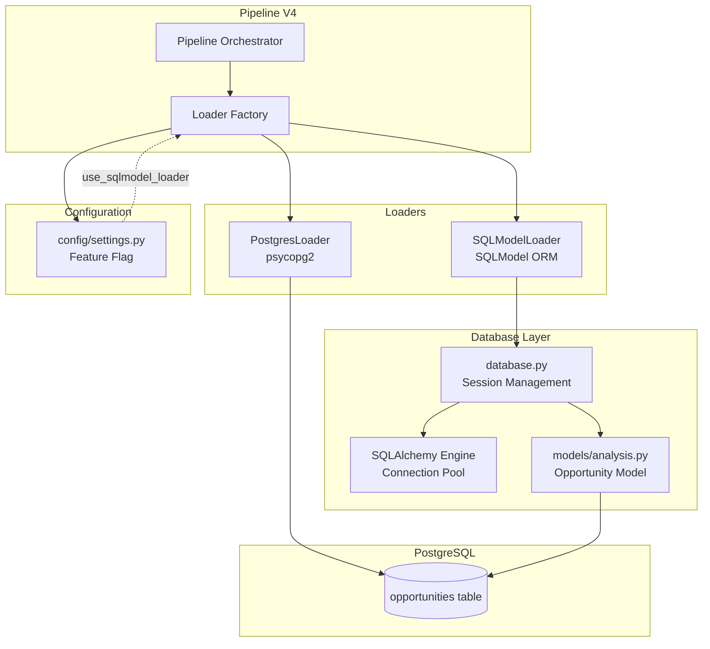
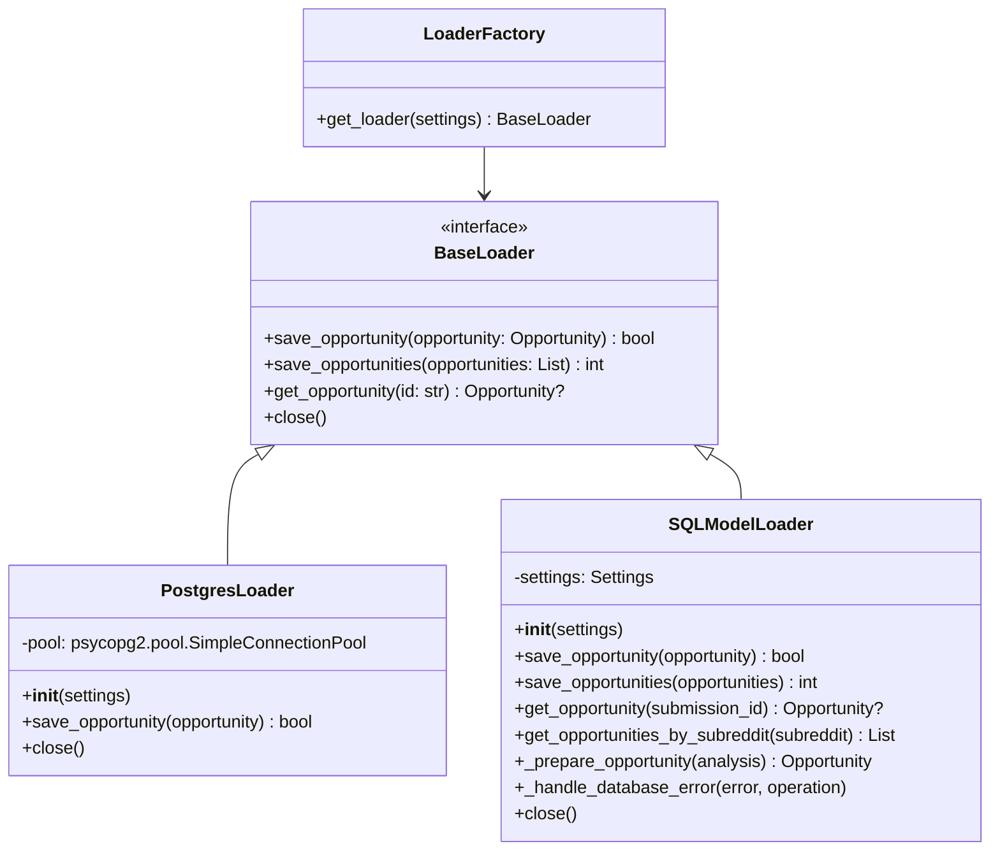
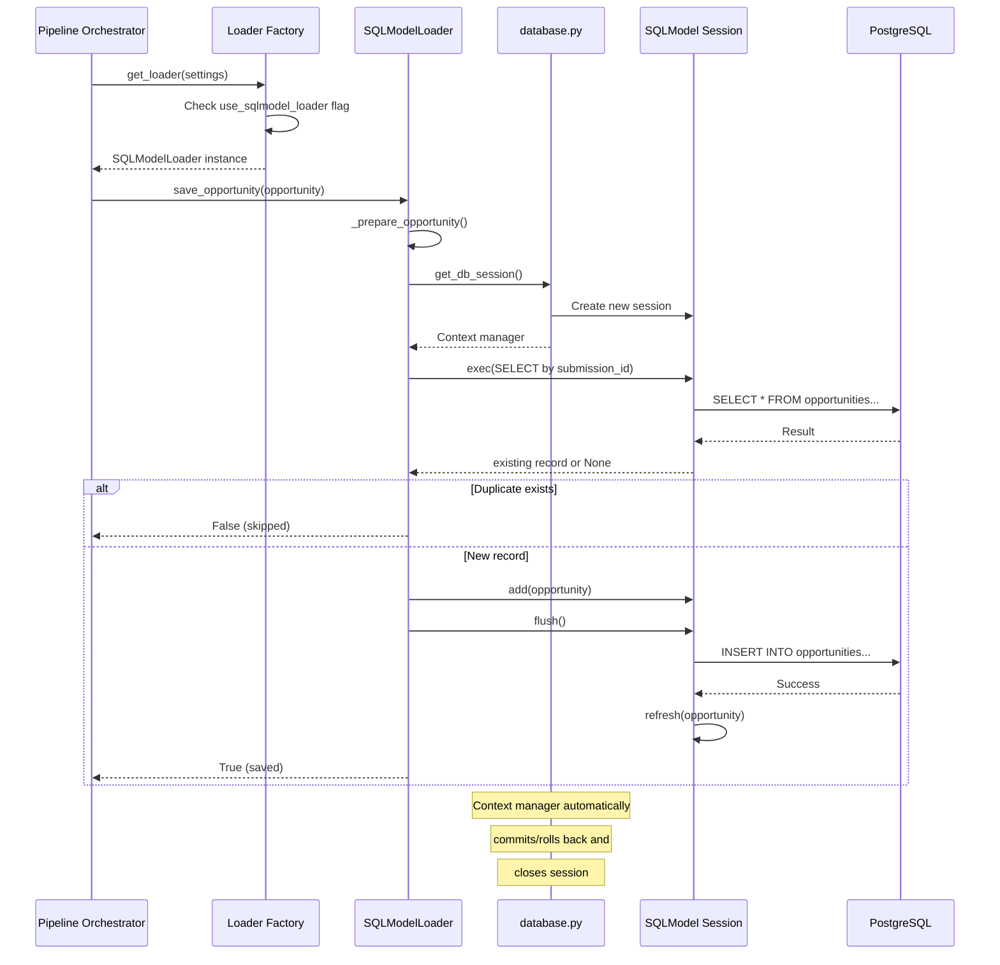
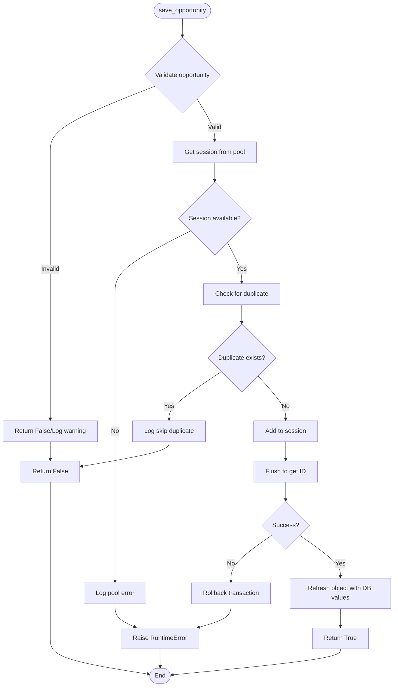

# SQLModel Loader Architecture

## Component Diagram



## Class Hierarchy



## Session Management Flow



## Error Handling Flow



## Performance Considerations

### Connection Pool Strategy
```
┌─────────────────────────────────────────┐
│ SQLModel Loader                         │
├─────────────────────────────────────────┤
│ ┌─────┐  ┌─────┐  ┌─────┐  ┌─────┐      │
│ │Sess │  │Sess │  │Sess │  │Sess │ ...  │
│ └─────┘  └─────┘  └─────┘  └─────┘      │
│    │        │        │        │        │
│    └────────┴────────┴────────┴────────┘ │
│                ↓                        │
│ ┌─────────────────────────────────────┐ │
│ │    SQLAlchemy Connection Pool        │ │
│ │  (pool_size=10, max_overflow=20)    │ │
│ └─────────────────────────────────────┘ │
│                ↓                        │
│ ┌─────────────────────────────────────┐ │
│ │        PostgreSQL Server            │ │
│ └─────────────────────────────────────┘ │
└─────────────────────────────────────────┘
```

### Batch Operations Optimization
```mermaid
graph LR
    subgraph "Inefficient: N Round Trips"
        A1[Opportunity 1] --> B1[Database]
        A2[Opportunity 2] --> B2[Database]
        A3[Opportunity 3] --> B3[Database]
        A4[...] --> B4[...]
    end

    subgraph "Efficient: 2 Round Trips"
        C1[All Opportunities] --> D1[session.add_all()]
        D1 --> D2[Single INSERT]
        D2 --> D3[session.flush()]
    end
```

## Migration Path

```mermaid
timeline
    title SQLModel Loader Migration Timeline

    section Phase 2: Implementation
        Design Review : Complete
        Write Tests    : 2 days
        Implement     : 3 days

    section Phase 3: Integration
        Feature Flag  : 1 day
        Factory Pattern: 1 day
        A/B Testing   : 2 days

    section Phase 4: Production
        10% Traffic  : Day 1
        25% Traffic  : Day 2
        50% Traffic  : Day 3
        75% Traffic  : Day 4
        100% Traffic : Day 5
        Monitor      : 7 days
```