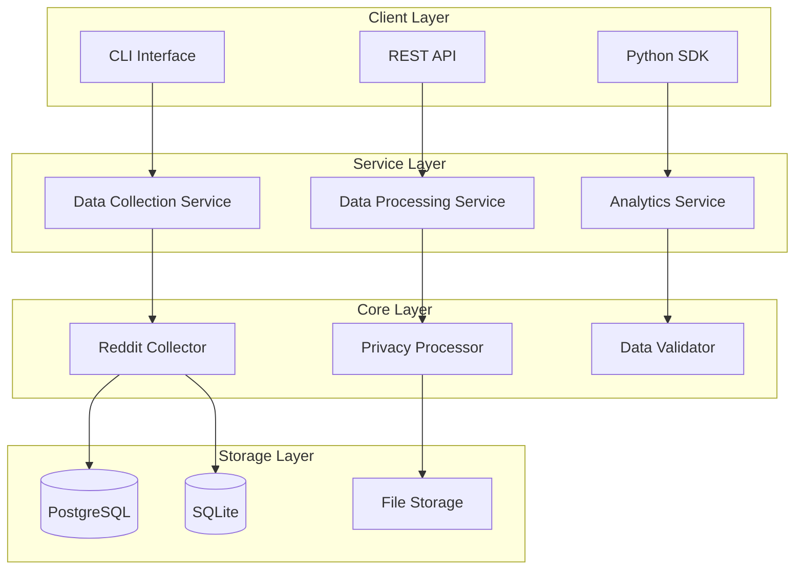
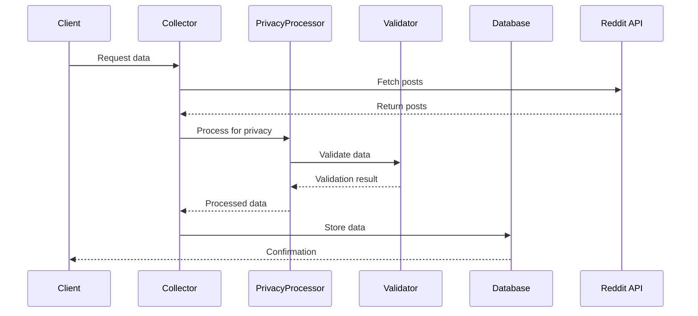
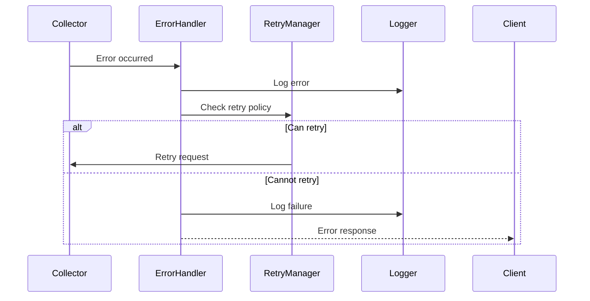

# RedditHarbor Architecture

<div style="text-align: center; margin: 20px 0;">
  <h2 style="color: #FF6B35;">System Design & Architecture</h2>
  <p style="color: #004E89;">Technical design decisions and system architecture</p>
</div>

## 🏗️ Overview

RedditHarbor follows a modular, service-oriented architecture designed for scalability, maintainability, and extensibility. The system is built around core principles of data integrity, privacy preservation, and performance optimization.

---

## 🎯 Design Principles

1. **Modularity** - Each component has a single responsibility
2. **Scalability** - Designed to handle large-scale data collection
3. **Privacy-First** - Built-in privacy features and ethical safeguards
4. **Extensibility** - Easy to add new data sources and storage backends
5. **Reliability** - Robust error handling and recovery mechanisms

---

## 📋 System Architecture



---

## 🔧 Core Components

### 1. Data Collection Service

**Responsibilities:**
- Reddit API interaction
- Rate limit management
- Error handling and retries
- Data quality validation

**Key Classes:**
```python
class RedditCollector:
    - fetch_subreddit_posts()
    - fetch_post_comments()
    - fetch_user_data()
    - handle_rate_limits()
```

### 2. Privacy Processing Service

**Responsibilities:**
- User data anonymization
- PII detection and redaction
- Privacy policy enforcement
- Compliance checking

**Key Classes:**
```python
class PrivacyProcessor:
    - anonymize_user_data()
    - redact_pii()
    - validate_privacy_compliance()
    - apply_privacy_rules()
```

### 3. Data Storage Service

**Responsibilities:**
- Database connection management
- Schema management
- Data indexing
- Query optimization

**Supported Databases:**
- PostgreSQL (production)
- SQLite (development/ testing)
- File storage (exports)

---

## 🗄️ Database Schema

### Core Tables

```sql
-- Posts table
CREATE TABLE reddit_posts (
    id VARCHAR(20) PRIMARY KEY,
    subreddit VARCHAR(100) NOT NULL,
    title TEXT NOT NULL,
    content TEXT,
    author_id VARCHAR(20),
    created_at TIMESTAMP,
    score INTEGER,
    num_comments INTEGER,
    collected_at TIMESTAMP DEFAULT CURRENT_TIMESTAMP
);

-- Comments table
CREATE TABLE reddit_comments (
    id VARCHAR(20) PRIMARY KEY,
    post_id VARCHAR(20) REFERENCES reddit_posts(id),
    parent_id VARCHAR(20),
    author_id VARCHAR(20),
    content TEXT,
    score INTEGER,
    created_at TIMESTAMP,
    collected_at TIMESTAMP DEFAULT CURRENT_TIMESTAMP
);

-- Users table (anonymized)
CREATE TABLE reddit_users (
    id VARCHAR(20) PRIMARY KEY,
    username_hash VARCHAR(64),
    karma INTEGER,
    account_created_at TIMESTAMP,
    last_active_at TIMESTAMP
);
```

### Indexes for Performance

```sql
-- Performance indexes
CREATE INDEX idx_posts_subreddit ON reddit_posts(subreddit);
CREATE INDEX idx_posts_created_at ON reddit_posts(created_at);
CREATE INDEX idx_comments_post_id ON reddit_comments(post_id);
CREATE INDEX idx_comments_author_id ON reddit_comments(author_id);
```

---

## 🔒 Privacy Architecture

### Privacy Layers

1. **Collection Layer**
   - Minimal data collection
   - Configurable privacy settings
   - Consent management

2. **Processing Layer**
   - Automatic PII detection
   - Data anonymization
   - Privacy rule enforcement

3. **Storage Layer**
   - Encrypted storage options
   - Access controls
   - Audit logging

### Privacy Features

```python
class PrivacyConfig:
    # Anonymization settings
    anonymize_usernames: bool = True
    redact_user_flair: bool = True
    remove_reddit_internal_data: bool = True

    # Data minimization
    collect_user_history: bool = False
    collect_private_info: bool = False
    retain_deleted_content: bool = False
```

---

## 🚀 Performance Architecture

### Rate Limiting Strategy

<div style="background: #F5F5F5; padding: 15px; border-radius: 8px; border-left: 4px solid #F7B801; margin: 20px 0;">
  <h4 style="color: #1A1A1A; margin-top: 0;">Rate Limit Implementation</h4>
  <p style="color: #1A1A1A; margin: 0;">
    RedditHarbor implements a sophisticated rate limiting system that respects Reddit's API limits while maximizing collection efficiency:
  </p>
  <ul style="color: #1A1A1A; padding-left: 20px;">
    <li><strong>Burst Management:</strong> Handles burst requests with backoff</li>
    <li><strong>Adaptive Throttling:</strong> Adjusts rate based on response times</li>
    <li><strong>Concurrent Controls:</strong> Manages multiple collection threads</li>
  </ul>
</div>

### Caching Strategy

```python
class CacheManager:
    """Multi-level caching for performance optimization."""

    def __init__(self):
        self.memory_cache = {}  # LRU cache for frequently accessed data
        self.disk_cache = {}    # Persistent cache for large datasets
        self.redis_cache = {}   # Distributed cache for cluster deployments
```

---

## 🔄 Data Flow

### Collection Pipeline



### Error Handling Flow



---

## 🔧 Configuration Architecture

### Configuration Management

```python
# Configuration hierarchy
ConfigLoader:
    1. Environment variables
    2. Configuration files
    3. Default values
    4. Runtime overrides
```

### Settings Structure

```python
class RedditHarborConfig:
    # API settings
    api_credentials: APICredentials
    rate_limits: RateLimitConfig

    # Privacy settings
    privacy_config: PrivacyConfig

    # Database settings
    database_config: DatabaseConfig

    # Performance settings
    cache_config: CacheConfig
    concurrency_config: ConcurrencyConfig
```

---

## 📊 Monitoring & Observability

### Metrics Collection

```python
class MetricsCollector:
    def collect_api_metrics(self):
        # API call counts, response times, error rates
        pass

    def collect_performance_metrics(self):
        # Memory usage, CPU usage, throughput
        pass

    def collect_business_metrics(self):
        # Data collection rates, storage usage
        pass
```

### Health Checks

```python
class HealthChecker:
    def check_api_connectivity(self):
        # Verify Reddit API access
        pass

    def check_database_health(self):
        # Verify database connectivity
        pass

    def check_rate_limits(self):
        # Verify rate limit compliance
        pass
```

---

## 🔮 Extensibility Architecture

### Plugin System

RedditHarbor supports plugins for:

1. **Data Sources** - Add new social media platforms
2. **Storage Backends** - Add new database systems
3. **Processors** - Add custom data processing logic
4. **Exporters** - Add new export formats

### Plugin Interface

```python
class DataProcessorPlugin:
    def process(self, data: Dict) -> Dict:
        """Process data according to plugin logic."""
        pass

    def validate(self, data: Dict) -> bool:
        """Validate processed data."""
        pass
```

---

## 🚦 Deployment Architecture

### Deployment Options

1. **Local Development**
   - SQLite database
   - Single-threaded collection
   - Basic logging

2. **Production Deployment**
   - PostgreSQL database
   - Multi-threaded collection
   - Advanced monitoring
   - Load balancing

3. **Cloud Deployment**
   - Managed database services
   - Auto-scaling collectors
   - Distributed processing
   - Advanced security

### Infrastructure Requirements

```yaml
# Minimum requirements
min_resources:
  cpu: 2 cores
  memory: 4GB RAM
  storage: 100GB SSD
  network: 100Mbps

# Recommended for production
recommended_resources:
  cpu: 8 cores
  memory: 16GB RAM
  storage: 1TB SSD
  network: 1Gbps
```

---

<div style="text-align: center; margin-top: 30px; padding-top: 20px; border-top: 2px solid #F5F5F5;">
  <p style="color: #666; font-size: 0.9em;">
    For detailed implementation guides, see our <a href="../guides/deployment.md" style="color: #004E89;">Deployment Guide</a>
  </p>
</div>